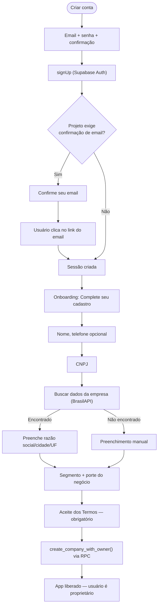
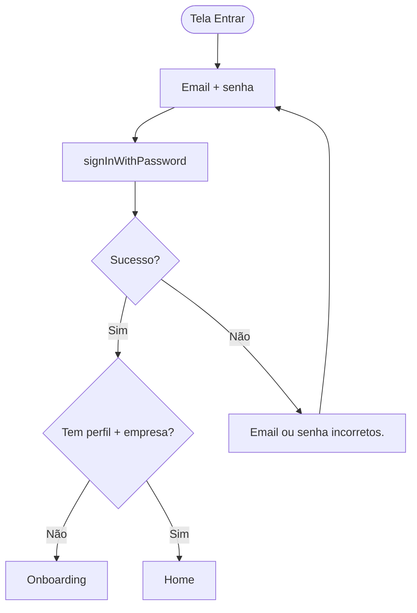
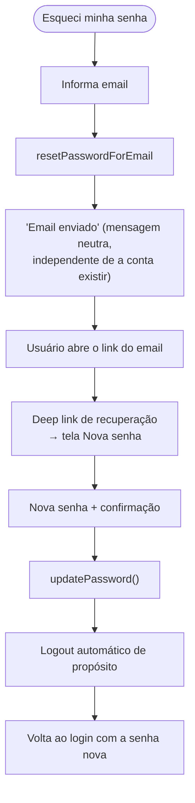
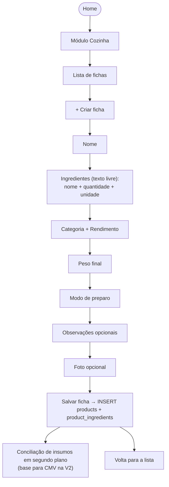
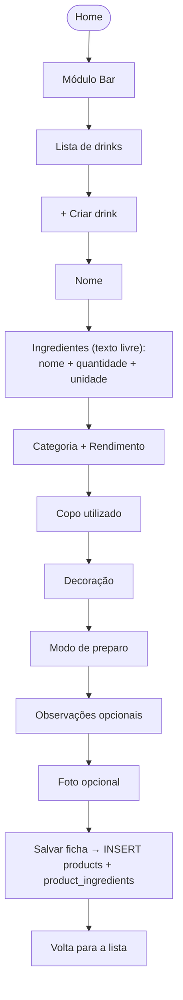
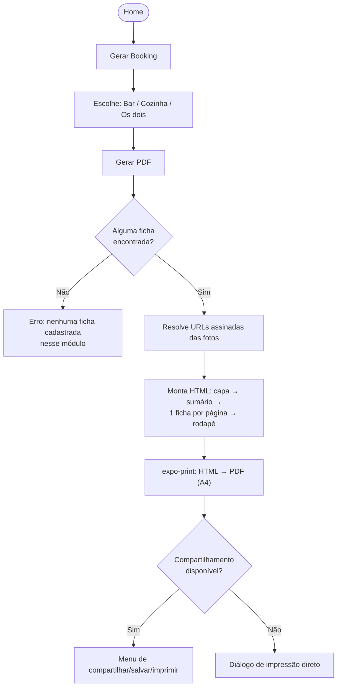
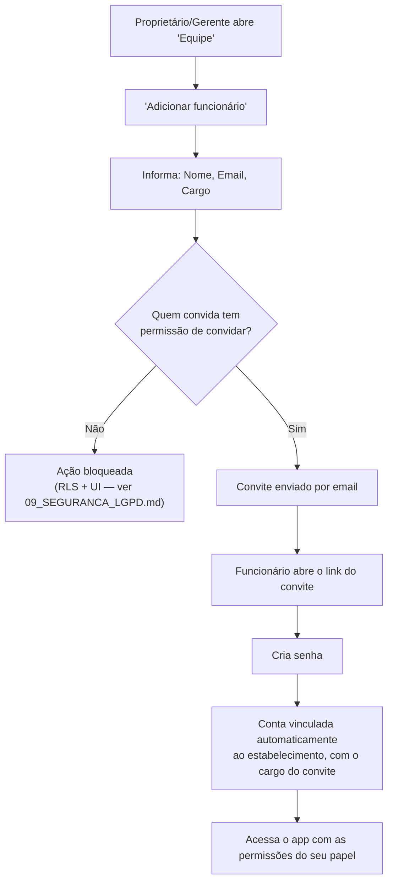
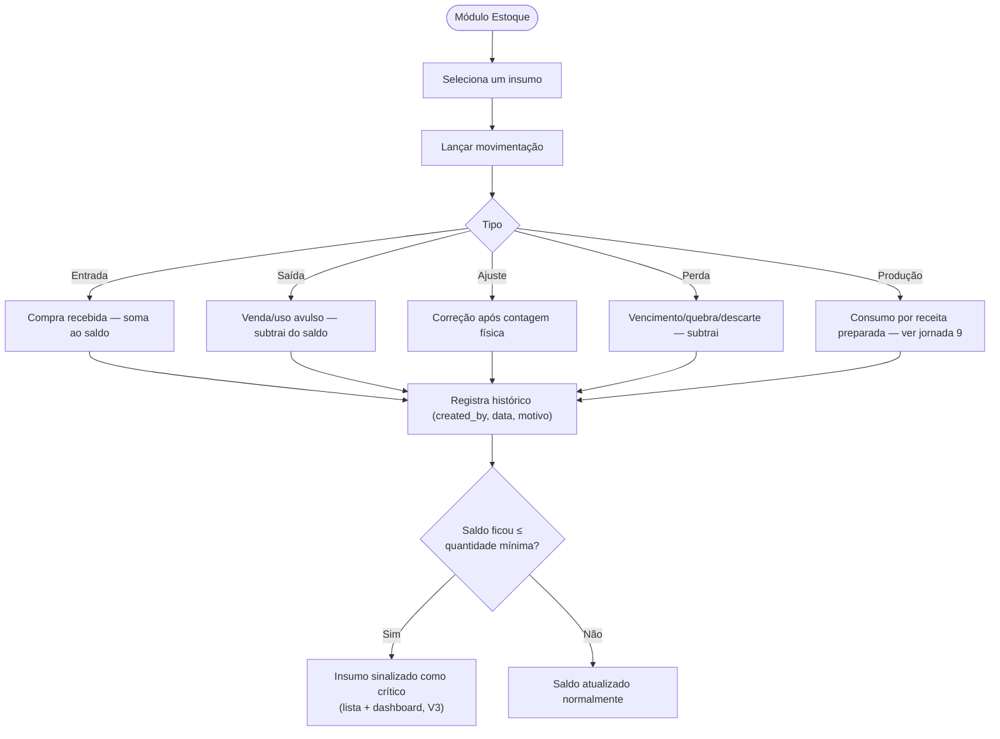
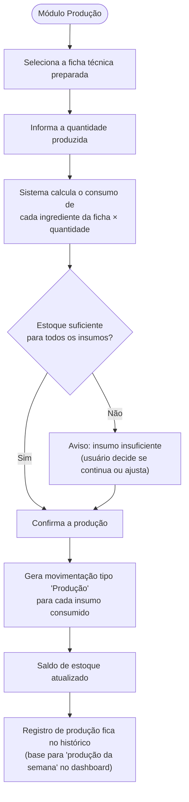
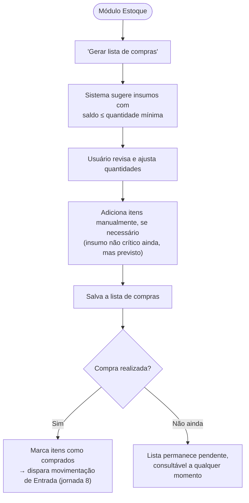

# 03 — Jornada do Usuário

## Índice

1. [Cadastro](#1-cadastro-✅-implementado)
2. [Login](#2-login-✅-implementado)
3. [Recuperação de senha](#3-recuperação-de-senha-✅-implementado)
4. [Criar ficha técnica (Cozinha)](#4-criar-ficha-técnica-cozinha-✅-implementado)
5. [Criar drink (Bar)](#5-criar-drink-bar-✅-implementado)
6. [Gerar PDF (Booking)](#6-gerar-pdf-booking-✅-implementado)
7. [Convidar funcionário](#7-convidar-funcionário-🔜-planejado-v2)
8. [Movimentar estoque](#8-movimentar-estoque-🔜-planejado-v2)
9. [Produção](#9-produção-🔜-planejado-v3)
10. [Lista de compras](#10-lista-de-compras-🔜-planejado-v3)

> Cada jornada é marcada com seu status real: **✅ Implementado** (código em produção, testado) ou **🔜 Planejado** (desenho de fluxo para orientar a implementação futura — sujeito a ajuste quando a V2/V3 entrar em desenvolvimento).

---

## 1. Cadastro (✅ Implementado)

## 2. Login (✅ Implementado)

## 3. Recuperação de senha (✅ Implementado)

## 4. Criar ficha técnica (Cozinha) (✅ Implementado)

## 5. Criar drink (Bar) (✅ Implementado)

Mesmo editor de ficha da Cozinha, com os campos condicionais do Bar no lugar dos da Cozinha:

## 6. Gerar PDF (Booking) (✅ Implementado)

## 7. Convidar funcionário (🔜 Planejado V2)

## 8. Movimentar estoque (🔜 Planejado V2)

## 9. Produção (🔜 Planejado V3)

## 10. Lista de compras (🔜 Planejado V3)

