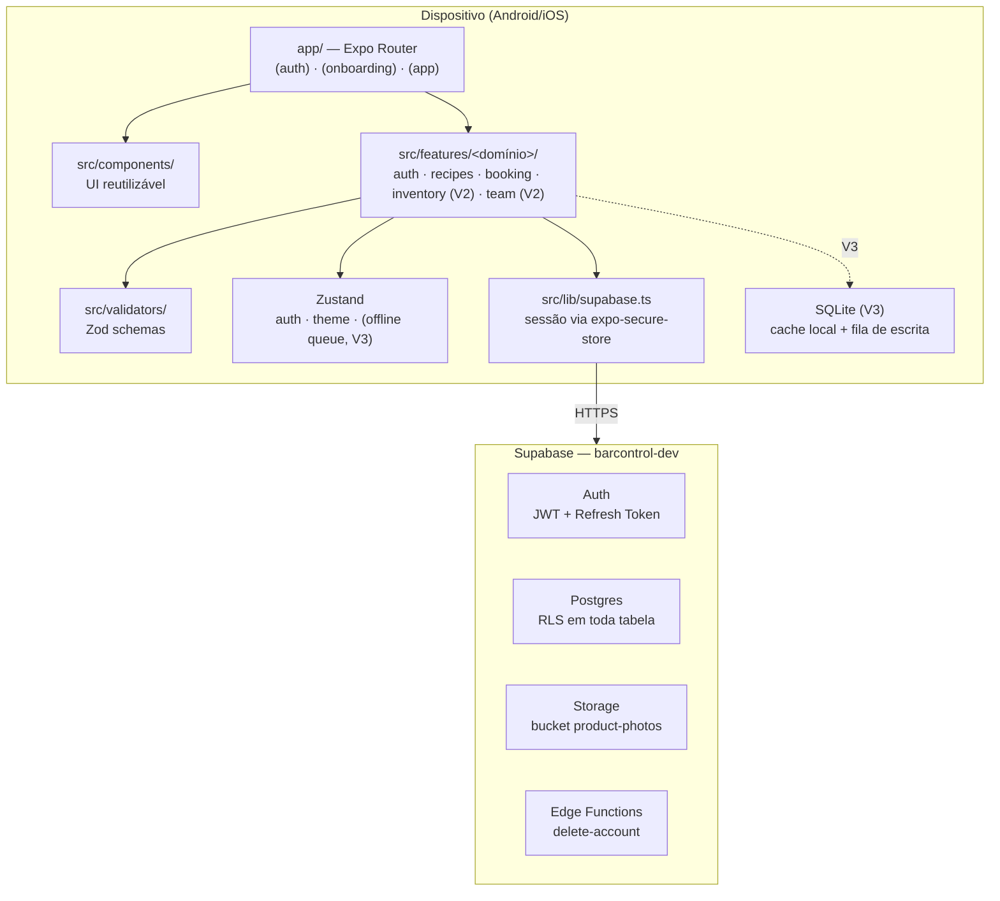
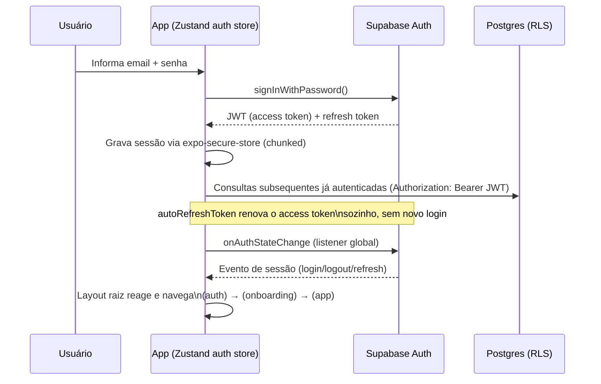
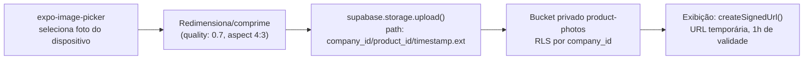
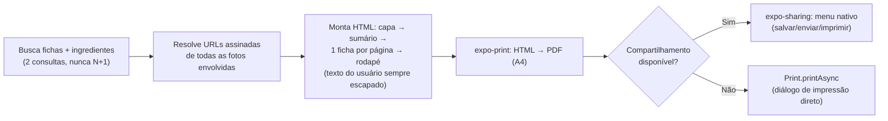
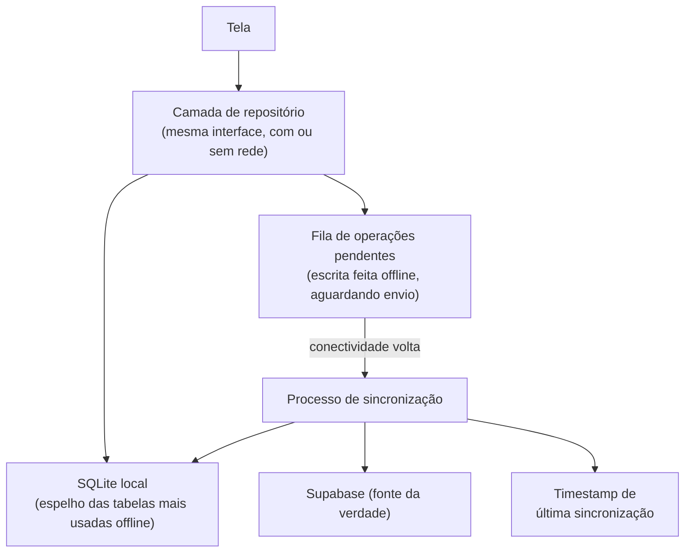

# 06 — Arquitetura

## Índice

1. [Stack](#1-stack)
2. [Visão geral e diagrama de arquitetura](#2-visão-geral-e-diagrama-de-arquitetura)
3. [Estrutura de pastas](#3-estrutura-de-pastas)
4. [Fluxo de autenticação](#4-fluxo-de-autenticação)
5. [Gerenciamento de estado](#5-gerenciamento-de-estado)
6. [Upload de imagens](#6-upload-de-imagens)
7. [Geração de PDF](#7-geração-de-pdf)
8. [Offline Sync (planejado — V3)](#8-offline-sync-planejado--v3)

---

## 1. Stack

| Camada | Tecnologia | Status |
|---|---|---|
| Runtime mobile | React Native + Expo (SDK 57) | ✅ Em produção |
| Linguagem | TypeScript (estrito, 100% do código) | ✅ Em produção |
| Roteamento | Expo Router (rotas por arquivo, grupos protegidos) | ✅ Em produção |
| Estilo | NativeWind (Tailwind para React Native) | ✅ Em produção |
| Estado global | Zustand | ✅ Em produção |
| Formulários | React Hook Form | ✅ Em produção |
| Validação | Zod | ✅ Em produção |
| Backend | Supabase (Postgres + Auth + Storage + Edge Functions) | ✅ Em produção |
| Sessão segura | expo-secure-store (Keychain/Keystore) | ✅ Em produção |
| PDF | expo-print + expo-sharing | ✅ Em produção |
| Offline | SQLite (`expo-sqlite`) + fila de sincronização própria | 🔜 Planejado (V3) |

Esta é a stack **obrigatória** do projeto — qualquer proposta de substituição de uma dessas peças (ex.: trocar Zustand por Redux, ou Supabase por um backend próprio) exige revisão deste documento e justificativa registrada, não uma troca silenciosa em um PR.

## 2. Visão geral e diagrama de arquitetura

O app é **client-heavy**: a lógica de negócio roda no dispositivo, em TypeScript, e fala diretamente com o Supabase — não há uma API própria no meio do caminho, exceto para as duas operações que exigem privilégio de servidor (criação de empresa via função `SECURITY DEFINER`, e exclusão de conta via Edge Function). Toda a autorização de acesso a dado fica no banco (RLS), nunca decidida só pelo client — ver `09_SEGURANCA_LGPD.md`.



## 3. Estrutura de pastas

```
mobile/
├── app/                     # Rotas (Expo Router)
│   ├── (auth)/               # Sem sessão: login, cadastro, recuperação
│   ├── (onboarding)/         # Sessão sem empresa: cadastro do estabelecimento
│   └── (app)/                # Sessão completa: Home, módulos, perfil
│       ├── recipes/[type]/   # Fichas — Bar/Cozinha por parâmetro de rota
│       ├── inventory/        # V2 — estoque
│       ├── team/              # V2 — equipe/convites
│       └── dashboard/         # V3
├── src/
│   ├── components/           # UI reutilizável, sem chamada de rede
│   ├── features/<domínio>/   # Lógica de negócio por domínio (api.ts por feature)
│   ├── validators/           # Schemas Zod — contrato único formulário↔API
│   ├── lib/                  # Cliente Supabase, cliente SQLite (V3)
│   ├── hooks/
│   └── types/
├── docs/                     # Este pacote de documentação
├── app.json / package.json / tsconfig.json / tailwind.config.js
```

Direção de dependência única e obrigatória: **rota → feature → validador/lib**, nunca o inverso. Isso é o que permite testar a lógica de negócio sem renderizar nenhuma tela (ver `12_CRITERIOS_ACEITE.md` e os critérios de qualidade da documentação técnica da V1).

## 4. Fluxo de autenticação



O app nunca decodifica ou confia em conteúdo do JWT no client — ele é tratado como token opaco, repassado automaticamente pelo SDK. Detalhamento completo (hash de senha, RLS, funções `SECURITY DEFINER`) em `09_SEGURANCA_LGPD.md`.

## 5. Gerenciamento de estado

| Tipo de estado | Onde vive | Por quê |
|---|---|---|
| Sessão, perfil, vínculo com empresa | Zustand (`useAuthStore`) | Precisa ser lido por qualquer tela/feature, de forma síncrona, sem prop drilling |
| Preferência de tema | Zustand (`useThemeStore`), persistida em `expo-secure-store` | Mesmo motivo — estado global de UI, pequeno e estável |
| Fila de escrita offline (V3) | Zustand + SQLite | O estado "o que ainda não sincronizou" precisa sobreviver a fechar o app |
| Estado de formulário | React Hook Form (local ao componente) | Nunca vai para o estado global — é efêmero e específico da tela |
| Dado remoto (lista de fichas, insumos) | Estado local do componente (`useState` + `useFocusEffect`), sem cache global | O volume por estabelecimento é pequeno (dezenas de itens); não há uma lib de cache de servidor (TanStack Query) no projeto — decisão deliberada de manter a stack enxuta enquanto o volume de dado não justificar o contrário |

**Regra:** nenhum dado que pode ser derivado de uma consulta ao Supabase deve ser duplicado permanentemente no estado global — o Zustand global fica reservado para sessão, preferências de UI e (V3) a fila offline.

## 6. Upload de imagens



Nunca uma URL pública direta — toda exibição de foto (na lista, no editor, no booking em PDF) passa por uma URL assinada gerada sob demanda. Detalhes de segurança do bucket em `09_SEGURANCA_LGPD.md`.

## 7. Geração de PDF



A geração acontece inteiramente no dispositivo — não existe um serviço de geração de PDF no servidor. Isso simplifica a arquitetura (sem fila de job, sem armazenamento intermediário do PDF) ao custo de o processamento depender da capacidade do aparelho do usuário; para o volume esperado (dezenas de fichas por booking), essa é uma troca aceitável.

## 8. Offline Sync (planejado — V3)

**Ainda não implementado.** A V1 e a V2 planejada exigem conexão de rede para qualquer operação de escrita ou leitura — não há cache local persistente hoje. A V3 introduz um modelo offline-first para as operações mais usadas em campo (consultar ficha, lançar movimentação de estoque, registrar produção), onde a conectividade do estabelecimento pode ser instável.

### 8.1 Componentes da arquitetura



- **SQLite:** espelho local das entidades necessárias para operar offline (fichas técnicas do estabelecimento atual, insumos, saldo de estoque). Não é um cache de tudo — só do que o app precisa para funcionar sem rede.
- **Fila de operações:** toda escrita feita offline (criar/editar ficha, lançar movimentação, registrar produção) é gravada localmente como uma operação pendente, na ordem em que aconteceu — nunca perdida, mesmo que o app feche antes de sincronizar.
- **Sincronização:** ao detectar conectividade, a fila é processada em ordem (FIFO), operação por operação, contra o Supabase — mesma regra de negócio de nunca apagar histórico já aplicada em toda a V1/V2 (uma operação que falhar na sincronização fica retida na fila para nova tentativa, nunca descartada silenciosamente).
- **Resolução de conflitos:** a estratégia padrão é **"o servidor primeiro, com aviso"** — se o mesmo registro foi alterado no servidor por outro usuário/dispositivo entre a escrita offline e a sincronização, a versão do servidor prevalece automaticamente para dados críticos de estoque (evita duplicar/perder movimentação), e o usuário é avisado quando sua edição de ficha técnica precisa ser revisada manualmente (mesclagem automática de texto livre é sujeita a erro e não é feita silenciosamente).
- **Última sincronização:** timestamp visível na interface (ex.: na tela de Estoque, "Sincronizado há 3 min" ou "Sincronização pendente — 4 operações na fila"), para que o usuário nunca opere às cegas sobre o estado de conectividade dos seus dados.

### 8.2 O que fica de fora do offline (mesmo na V3)

Autenticação (login inicial), geração de booking em PDF (depende de buscar fotos atualizadas) e qualquer operação que exija a função `SECURITY DEFINER` do servidor (criação de empresa) continuam exigindo conectividade — o offline-first cobre o **uso operacional do dia a dia**, não o app inteiro.
