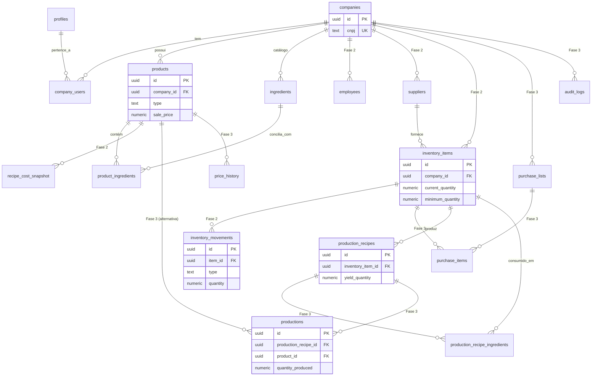

# 07 — Database

## Índice

1. [Convenções](#1-convenções)
2. [Fase 1 — núcleo (implementado)](#2-fase-1--núcleo-implementado)
3. [Fase 2 — estoque, custo e equipe (planejado)](#3-fase-2--estoque-custo-e-equipe-planejado)
4. [Fase 3 — compras, produção e auditoria (planejado)](#4-fase-3--compras-produção-e-auditoria-planejado)
5. [DER — visão completa](#5-der--visão-completa)

---

## 1. Convenções

- `id` é sempre `uuid`, gerado por `gen_random_uuid()`.
- Datas são sempre `timestamptz` (nunca `timestamp` sem fuso).
- Nenhuma tabela de domínio permite `DELETE` como fluxo normal — exclusão é sempre lógica (`is_active`) ou, em casos específicos (conta, empresa), uma operação explícita e única.
- Toda tabela nova das Fases 2 e 3 herda RLS por `company_id`, seguindo o mesmo modelo já validado na Fase 1 (ver `09_SEGURANCA_LGPD.md`).

## 2. Fase 1 — núcleo (implementado)

> **Nota de rastreabilidade:** o desenho conceitual desta fase (`establishments`, `users`, `recipes`, `ingredients`) já foi implementado — mas sobre um schema Postgres/Supabase **reaproveitado** de um sistema já em produção, não criado do zero com esses nomes literais. A tabela abaixo mostra o mapeamento; os campos documentados na sequência são os das tabelas **reais**, para que este documento sirva de referência precisa, não aspiracional.

| Conceito (Fase 1) | Tabela real | Observação |
|---|---|---|
| `establishments` | `companies` | Multi-tenant, CNPJ único, RLS validada |
| `users` | `auth.users` (Supabase Auth) + `profiles` | Senha nunca gerenciada pelo app — 100% Supabase Auth |
| `recipes` | `products` | Ficha técnica = uma linha desta tabela, com `type = 'bar' \| 'cozinha'` |
| `ingredients` (texto livre) | `product_ingredients.ingredient_name` | Sem cadastro prévio na Fase 1; catálogo `ingredients` já existe no banco e é alimentado em segundo plano (conciliação) |

### `companies`

| Campo | Tipo | PK/FK | Nullable | Descrição |
|---|---|---|---|---|
| `id` | uuid | PK | Não | Identificador da empresa |
| `cnpj` | text | — (unique) | Não | Somente dígitos, 14 caracteres |
| `legal_name` | text | — | Não | Razão social |
| `trade_name` | text | — | Sim | Nome fantasia |
| `segment` | text | — | Não | Enum de segmento (bar, restaurante, etc.) |
| `employee_range` | text | — | Não | Enum de porte |
| `city` / `state` | text | — | Não | Localização |
| `is_menu_public` | boolean | — | Não (default `false`) | Recurso do app web, fora do escopo do Booking Chef |
| `created_at` / `updated_at` | timestamptz | — | Não (auto) | Auditoria |

### `profiles`

| Campo | Tipo | PK/FK | Nullable | Descrição |
|---|---|---|---|---|
| `id` | uuid | PK / FK → `auth.users.id` | Não | Mesmo id do usuário no Supabase Auth |
| `name` | text | — | Não | Nome da pessoa |
| `email` | text | — | Não | Cópia de conveniência do email |
| `phone` | text | — | Sim | Telefone |
| `terms_accepted_at` | timestamptz | — | Sim | Evidência de consentimento LGPD |
| `marketing_opt_in` | boolean | — | Não (default `false`) | Consentimento de marketing |
| `created_at` / `updated_at` | timestamptz | — | Não (auto) | Auditoria |

### `company_users`

| Campo | Tipo | PK/FK | Nullable | Descrição |
|---|---|---|---|---|
| `id` | uuid | PK | Não | Identificador do vínculo |
| `company_id` | uuid | FK → `companies.id` | Não | Empresa |
| `user_id` | uuid | FK → `profiles.id` | Não | Usuário |
| `role` | text | — | Não | Papel (ver matriz RBAC em `09_SEGURANCA_LGPD.md`) |
| `is_owner` | boolean | — | Não (default `false`) | Flag de conveniência |
| `created_at` | timestamptz | — | Não (auto) | Auditoria |

### `products` (ficha técnica)

| Campo | Tipo | PK/FK | Nullable | Descrição |
|---|---|---|---|---|
| `id` | uuid | PK | Não | Identificador da ficha |
| `company_id` | uuid | FK → `companies.id` | Não | Empresa dona |
| `name` | text | — | Não | Nome do prato/drink |
| `category` | text | — | Sim | Categoria livre |
| `type` | text | — | Sim | `bar` \| `cozinha` \| nulo (cardápio digital legado) |
| `sale_price` | numeric | — | Não | Grava `0` na Fase 1 (sem preço de venda ainda) |
| `is_active` | boolean | — | Não (default `true`) | Soft delete |
| `photo_path` | text | — | Sim | Caminho no bucket `product-photos` |
| `yield_amount` | text | — | Sim | Rendimento (texto livre) |
| `glass_type` / `garnish` | text | — | Sim | Só Bar |
| `final_weight` | text | — | Sim | Só Cozinha |
| `instructions` | text | — | Sim | Modo de preparo |
| `notes` | text | — | Sim | Observações |
| `version` | integer | — | Não (default `1`) | Incrementado por trigger a cada `UPDATE` |
| `created_by` | uuid | FK → `auth.users.id` | Sim | Auditoria de criação |
| `created_at` / `updated_at` | timestamptz | — | Não (auto) | Auditoria |

### `product_ingredients`

| Campo | Tipo | PK/FK | Nullable | Descrição |
|---|---|---|---|---|
| `id` | uuid | PK | Não | Identificador da linha |
| `product_id` | uuid | FK → `products.id` | Não | Ficha à qual pertence |
| `ingredient_id` | uuid | FK → `ingredients.id` | Sim | Vínculo com o catálogo (preenchido por conciliação em segundo plano, ou manualmente na Fase 2) |
| `ingredient_name` | text | — | Sim* | Nome digitado livremente (*obrigatório na prática enquanto `ingredient_id` for nulo) |
| `quantity` | numeric | — | Não | Quantidade na receita |
| `unit` | text | — | Não | `kg`, `g`, `l`, `ml`, `un` |
| `created_at` | timestamptz | — | Não (auto) | Auditoria |

### `ingredients` (catálogo — já existe no banco compartilhado, alimentado desde a Fase 1)

| Campo | Tipo | PK/FK | Nullable | Descrição |
|---|---|---|---|---|
| `id` | uuid | PK | Não | Identificador do insumo |
| `company_id` | uuid | FK → `companies.id` | Não | Empresa dona |
| `category_id` | uuid | FK → `ingredient_categories.id` | Sim | Categoria |
| `name` | text | — | Não | Nome do insumo |
| `purchase_unit` / `usage_unit` | text | — | Não | Unidade de compra/uso |
| `package_content` | numeric | — | Não | Conteúdo da embalagem |
| `package_price` | numeric | — | Não | Preço da embalagem |
| `unit_cost` | numeric | — (gerado) | Sim | `package_price / package_content`, calculado automaticamente |
| `is_active` | boolean | — | Não (default `true`) | Soft delete |
| `created_at` / `updated_at` | timestamptz | — | Não (auto) | Auditoria |

## 3. Fase 2 — estoque, custo e equipe (planejado)

> **Nota de arquitetura:** antes de implementar `inventory_items` e `employees`, avaliar se devem estender `ingredients` e `company_users` (já existentes e já validados) em vez de nascer como tabelas paralelas — mesmo princípio já aplicado com sucesso na Fase 1 (`products` reaproveitado em vez de `recipes` novo). As tabelas abaixo são especificadas de forma independente, como pedido, precisamente para que essa decisão de arquitetura possa ser tomada por comparação direta.
>
> **Decisão registrada (Sprint 1, spike concluído):**
> - **Estoque → estender `ingredients`.** Insumo de estoque é o mesmo insumo já usado na ficha técnica (Fase 1/8, conciliação); uma tabela `inventory_items` paralela criaria dois catálogos do mesmo insumo real podendo divergir. Migration aplicada: `ingredients` ganhou `current_quantity`, `minimum_quantity`, `internal_code`, `barcode`, `supplier_id` (FK pra `suppliers`, tabela nova de verdade — sem análogo na Fase 1). `current_quantity` só deve mudar via `inventory_movements` (Sprint 2) — a Sprint 1 só cria/lê insumos com saldo inicial 0.
> - **Equipe → `employees` paralela, como especificado abaixo.** Decisão consciente de não reaproveitar `company_users`: a tabela real tem `user_id` `NOT NULL` (incompatível com convite pendente, sem conta ainda) e só é escrita via `create_company_with_owner`, sem `INSERT`/`UPDATE` liberado — reaproveitar exigiria afrouxar essa trava já endurecida pra suportar convite/remoção. `employees` nasce isolada com sua própria policy de RLS por `company_id`, ainda não integrada a `is_member_of_company()` (isso é trabalho da Sprint 4, junto com o Épico 08).
>
> **Integração registrada (Sprint 5, história 08.3):** `private.my_role_in_company(company_id)` virou a fonte única de papel — retorna `'proprietario'` (via `company_users.is_owner`) ou o `employees.role` de um funcionário `ativo`, e `is_member_of_company()` passou a usar essa função por baixo dos panos (reconhece funcionário ativo, não só dono). Vale registrar por que `employees.role` usa um enum PRÓPRIO em vez do `company_users.role` legado: `company_users.role` tem `'bartender_cozinha'` (não dá pra diferenciar bar de cozinha), então tentar reaproveitar essa coluna pra guardar o papel de um funcionário ativo quebraria exatamente a distinção que a história 08.3 precisa — por isso um funcionário ativo NUNCA ganha uma linha em `company_users`, só em `employees` mesmo. `can_read_product`/`can_write_product` (tipo bar/cozinha) e `can_access_inventory` (Estoque/Equipe só proprietario/gerente) são as funções que de fato leem esse papel nas policies de RLS de `products`/`product_ingredients`/`recipe_cost_snapshot`/`ingredients`/`suppliers`/`ingredient_categories`/`inventory_movements`/`employees`. Armadilha real encontrada e corrigida durante os testes: `my_role_in_company` PRECISA ser `SECURITY DEFINER` — sem isso, a consulta interna a `employees` reaciona a própria policy de RLS de `employees` (que chama `can_access_inventory` → `my_role_in_company`), causando recursão infinita ("stack depth limit exceeded").

### `employees`

| Campo | Tipo | PK/FK | Nullable | Descrição |
|---|---|---|---|---|
| `id` | uuid | PK | Não | Identificador do vínculo funcionário-estabelecimento |
| `company_id` | uuid | FK → `companies.id` | Não | Estabelecimento |
| `user_id` | uuid | FK → `profiles.id` | Sim | Nulo enquanto o convite está pendente (conta ainda não criada) |
| `name` | text | — | Não | Nome informado no convite |
| `email` | text | — | Não | Email do convite/login |
| `role` | text | — | Não | `proprietario` \| `gerente` \| `bartender` \| `cozinheiro` \| `visualizador` |
| `status` | text | — | Não (default `convidado`) | `convidado` \| `ativo` \| `removido` |
| `invited_by` | uuid | FK → `profiles.id` | Não | Quem enviou o convite |
| `invited_at` | timestamptz | — | Não (auto) | Data do convite |
| `activated_at` | timestamptz | — | Sim | Data em que o convite foi aceito |
| `created_at` / `updated_at` | timestamptz | — | Não (auto) | Auditoria |

### `suppliers`

| Campo | Tipo | PK/FK | Nullable | Descrição |
|---|---|---|---|---|
| `id` | uuid | PK | Não | Identificador do fornecedor |
| `company_id` | uuid | FK → `companies.id` | Não | Estabelecimento |
| `name` | text | — | Não | Nome do fornecedor |
| `contact_name` | text | — | Sim | Pessoa de contato |
| `phone` / `email` | text | — | Sim | Contato |
| `notes` | text | — | Sim | Observações |
| `is_active` | boolean | — | Não (default `true`) | Soft delete |
| `created_at` / `updated_at` | timestamptz | — | Não (auto) | Auditoria |

### `inventory_items`

| Campo | Tipo | PK/FK | Nullable | Descrição |
|---|---|---|---|---|
| `id` | uuid | PK | Não | Identificador do insumo em estoque |
| `company_id` | uuid | FK → `companies.id` | Não | Estabelecimento |
| `name` | text | — | Não | Nome do insumo |
| `category` | text | — | Sim | Categoria |
| `unit` | text | — | Não | Unidade de medida |
| `internal_code` | text | — | Sim | Código interno |
| `barcode` | text | — | Sim | Código de barras (opcional) |
| `current_quantity` | numeric | — | Não (default `0`) | Saldo atual — só alterado via `inventory_movements`, nunca editado direto |
| `minimum_quantity` | numeric | — | Não (default `0`) | Limite que dispara alerta de reposição |
| `supplier_id` | uuid | FK → `suppliers.id` | Sim | Fornecedor principal |
| `unit_cost` | numeric | — | Sim | Custo unitário — usado pelo Módulo CMV (`08_API.md`) |
| `is_active` | boolean | — | Não (default `true`) | Soft delete |
| `created_at` / `updated_at` | timestamptz | — | Não (auto) | Auditoria |

### `inventory_movements`

| Campo | Tipo | PK/FK | Nullable | Descrição |
|---|---|---|---|---|
| `id` | uuid | PK | Não | Identificador da movimentação |
| `item_id` | uuid | FK → `inventory_items.id` | Não | Insumo movimentado |
| `type` | text | — | Não | `entrada` \| `saida` \| `ajuste` \| `perda` \| `producao` |
| `quantity` | numeric | — | Não | Sempre positiva — a direção é dada por `type`, nunca por sinal negativo (evita ambiguidade em relatórios) |
| `reason` | text | — | Sim | Justificativa/observação |
| `reference_id` | uuid | — | Sim | Referência a `productions.id` ou `purchase_items.id`, quando a movimentação nasce de um desses fluxos |
| `created_by` | uuid | FK → `profiles.id` | Não | Quem lançou |
| `created_at` | timestamptz | — | Não (auto) | Nunca apagado — histórico permanente |

### `recipe_cost_snapshot`

| Campo | Tipo | PK/FK | Nullable | Descrição |
|---|---|---|---|---|
| `id` | uuid | PK | Não | Identificador do snapshot |
| `product_id` | uuid | FK → `products.id` | Não | Ficha técnica |
| `total_cost` | numeric | — | Não | Custo total calculado no momento do salvamento |
| `cost_per_portion` | numeric | — | Sim | Custo total ÷ rendimento |
| `cmv_percentage` | numeric | — | Sim | `total_cost / sale_price_at_snapshot × 100` |
| `sale_price_at_snapshot` | numeric | — | Sim | Preço de venda vigente no momento do cálculo |
| `calculated_at` | timestamptz | — | Não (auto) | Nunca recalculado retroativamente — histórico imutável |

## 4. Fase 3 — compras, produção e auditoria (planejado)

> **Nota de implementação real (Sprint 6, Épico 09 — Produção):** assim como a Fase 2 estendeu `ingredients` em vez de nascer `inventory_items`, a tabela `productions` abaixo referencia `ingredients` (não `inventory_items`, que nunca chegou a existir) via `inventory_movements.item_id`. Escopo desta rodada: só o caminho `product_id` (produzir uma ficha técnica vendável, `products`) — `production_recipe_id` **não foi criado ainda**; a tabela `production_recipes`/`production_recipe_ingredients` (sub-receitas internas, ex. "Xarope de gengibre") continua só planejada, sem migration aplicada, ver `11_BACKLOG.md` §2b. A baixa de estoque roda dentro da função `register_production` (SECURITY DEFINER, mesmo padrão de `register_inventory_movement`): para cada `product_ingredients` com `ingredient_id` preenchido, desconta `quantity × quantidade_produzida` de `ingredients.current_quantity` (nunca deixa saldo negativo, mesma trava da Fase 2) e grava uma linha em `inventory_movements` com `type = 'producao'` e `reference_id` apontando pra `productions.id`. `purchase_lists`/`purchase_items` e `audit_logs`/`price_history` seguem só planejados, sem migration.

### `purchase_lists`

| Campo | Tipo | PK/FK | Nullable | Descrição |
|---|---|---|---|---|
| `id` | uuid | PK | Não | Identificador da lista |
| `company_id` | uuid | FK → `companies.id` | Não | Estabelecimento |
| `status` | text | — | Não (default `aberta`) | `aberta` \| `concluida` |
| `created_by` | uuid | FK → `profiles.id` | Não | Quem gerou a lista |
| `created_at` | timestamptz | — | Não (auto) | Criação |
| `closed_at` | timestamptz | — | Sim | Quando todos os itens foram marcados como comprados |

### `purchase_items`

| Campo | Tipo | PK/FK | Nullable | Descrição |
|---|---|---|---|---|
| `id` | uuid | PK | Não | Identificador do item da lista |
| `purchase_list_id` | uuid | FK → `purchase_lists.id` | Não | Lista à qual pertence |
| `inventory_item_id` | uuid | FK → `inventory_items.id` | Não | Insumo a comprar |
| `suggested_quantity` | numeric | — | Sim | Sugestão automática (insumo abaixo do mínimo) |
| `quantity` | numeric | — | Não | Quantidade decidida pelo usuário |
| `purchased` | boolean | — | Não (default `false`) | Marcado ao confirmar a compra |
| `purchased_at` | timestamptz | — | Sim | Dispara `inventory_movements` tipo `entrada` ao ser marcado |

### `production_recipe_ingredients` (tabela de suporte, implícita)

> Não citada nominalmente no escopo original, mas estruturalmente necessária: sem ela, `production_recipes` não teria como listar os insumos que consome — o mesmo papel que `product_ingredients` cumpre para `products`. Adicionada aqui por completude e transparência, seguindo o mesmo padrão já validado.

| Campo | Tipo | PK/FK | Nullable | Descrição |
|---|---|---|---|---|
| `id` | uuid | PK | Não | Identificador da linha |
| `production_recipe_id` | uuid | FK → `production_recipes.id` | Não | Receita de produção |
| `inventory_item_id` | uuid | FK → `inventory_items.id` | Não | Insumo consumido |
| `quantity` | numeric | — | Não | Quantidade consumida por lote produzido |
| `unit` | text | — | Não | Unidade |

### `production_recipes`

| Campo | Tipo | PK/FK | Nullable | Descrição |
|---|---|---|---|---|
| `id` | uuid | PK | Não | Identificador da receita de produção |
| `company_id` | uuid | FK → `companies.id` | Não | Estabelecimento |
| `inventory_item_id` | uuid | FK → `inventory_items.id` | Não | O item de estoque que esta receita **produz** (ex.: "Xarope de gengibre") |
| `name` | text | — | Não | Nome da receita de produção |
| `yield_quantity` | numeric | — | Não | Rendimento, na unidade do item produzido |
| `instructions` | text | — | Sim | Modo de preparo interno |
| `is_active` | boolean | — | Não (default `true`) | Soft delete |
| `created_at` / `updated_at` | timestamptz | — | Não (auto) | Auditoria |

### `productions`

| Campo | Tipo | PK/FK | Nullable | Descrição |
|---|---|---|---|---|
| `id` | uuid | PK | Não | Identificador do evento de produção |
| `company_id` | uuid | FK → `companies.id` | Não | Estabelecimento |
| `production_recipe_id` | uuid | FK → `production_recipes.id` | Sim | Nulo quando a produção é de uma ficha técnica de venda (`products`), não de um item interno |
| `product_id` | uuid | FK → `products.id` | Sim | Preenchido quando a produção é de uma ficha técnica vendável, consumindo estoque diretamente |
| `quantity_produced` | numeric | — | Não | Quantidade produzida |
| `produced_by` | uuid | FK → `profiles.id` | Não | Quem registrou |
| `produced_at` | timestamptz | — | Não (auto) | Quando ocorreu |
| `notes` | text | — | Sim | Observações |

> Regra de negócio: exatamente um entre `production_recipe_id` e `product_id` deve estar preenchido — nunca os dois, nunca nenhum (constraint `CHECK`, mesmo padrão já usado em `product_ingredients_identity_check` na Fase 1).

### `audit_logs`

| Campo | Tipo | PK/FK | Nullable | Descrição |
|---|---|---|---|---|
| `id` | uuid | PK | Não | Identificador do registro de auditoria |
| `company_id` | uuid | FK → `companies.id` | Sim | Nulo para ações de nível de conta, antes de existir empresa |
| `user_id` | uuid | FK → `profiles.id` | Sim | Nulo se a ação foi do sistema (ex.: job automático) |
| `entity_type` | text | — | Não | Nome da tabela afetada (ex.: `products`, `inventory_items`) |
| `entity_id` | uuid | — | Não | Id do registro afetado |
| `action` | text | — | Não | `created` \| `updated` \| `archived` |
| `previous_value` | jsonb | — | Sim | Estado anterior (campos alterados) |
| `new_value` | jsonb | — | Sim | Estado novo |
| `created_at` | timestamptz | — | Não (auto) | Nunca apagado |

### `price_history`

| Campo | Tipo | PK/FK | Nullable | Descrição |
|---|---|---|---|---|
| `id` | uuid | PK | Não | Identificador do registro |
| `product_id` | uuid | FK → `products.id` | Não | Ficha técnica cujo preço mudou |
| `previous_price` | numeric | — | Não | Preço anterior |
| `new_price` | numeric | — | Não | Preço novo |
| `changed_by` | uuid | FK → `profiles.id` | Não | Quem alterou |
| `changed_at` | timestamptz | — | Não (auto) | Quando |
| `reason` | text | — | Sim | Motivo da alteração (ex.: "aplicado preço sugerido") |

## 5. DER — visão completa

