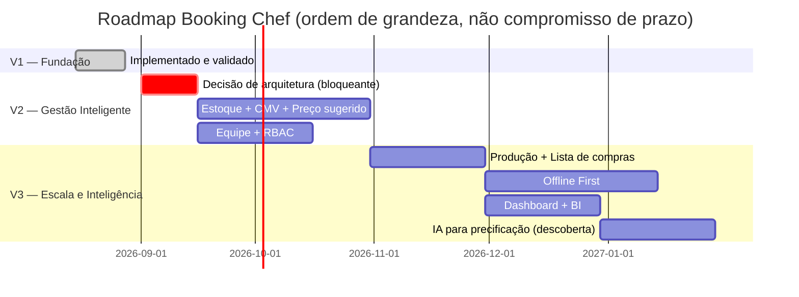

# 10 — Roadmap

## Índice

1. [V1 — Fundação](#1-v1--fundação-✅-entregue)
2. [V2 — Gestão Inteligente](#2-v2--gestão-inteligente-🔜-planejada)
3. [V3 — Escala e Inteligência](#3-v3--escala-e-inteligência-🔜-planejada)
4. [Linha do tempo consolidada](#4-linha-do-tempo-consolidada)

> Estimativas de tempo são **ordens de grandeza para planejamento**, não compromissos contratuais — refinadas à medida que o backlog de cada versão (`11_BACKLOG.md`) for detalhado em sprints.

---

## 1. V1 — Fundação (✅ entregue)

| | |
|---|---|
| **Objetivo** | Validar a proposta de valor central — ficha técnica organizada + booking em PDF — com o menor produto possível, sem exigir estoque nem múltiplos usuários. |
| **Escopo** | Login, Empresa (cadastro do estabelecimento), Fichas (Bar e Cozinha), Drinks, PDF. |
| **Valor entregue** | Um estabelecimento consegue, sozinho, sair do caderno/planilha para um app organizado, com material de treinamento/apresentação em PDF — sem precisar entender nada de estoque ou custo. |
| **Tempo investido** | Já concluído — arquitetura, implementação, testes automatizados (`tsc`, Jest, `expo export`) e documentação técnica completa. |
| **Dependências** | Nenhuma (é a base de tudo o mais). |
| **Status verificável** | Código em `mobile/`, schema real no Supabase (`barcontrol-dev`), documentado tecnicamente em `mobile/docs/DOCUMENTACAO-BOOKING-CHEF.md`. |

## 2. V2 — Gestão Inteligente (🔜 planejada)

| | |
|---|---|
| **Objetivo** | Transformar o app de "catálogo digital de receitas" em ferramenta de gestão de custo: estoque conectado à ficha técnica, CMV automático, preço sugerido e equipe com permissões. |
| **Escopo** | Estoque, CMV, Funcionários, Permissões, Lista de compras *(nota: Lista de compras foi originalmente listada aqui, mas — por depender do fluxo completo de produção/consumo de insumo estar maduro — este roadmap a realoca para a V3, junto de Produção; ver §3 e a justificativa de dependência abaixo)*. |
| **Valor entregue** | O proprietário passa a saber, com dado real, quanto cada receita custa e por quanto deveria vender; a operação deixa de depender de uma pessoa só, com convite de equipe e permissões por função. |
| **Tempo estimado** | 2 a 3 meses de desenvolvimento, após a decisão de arquitetura registrada como bloqueante no backlog (§ `11_BACKLOG.md`, Must have) — a decisão de reaproveitar `ingredients`/`company_users` ou criar tabelas novas (`07_DATABASE.md`, Nota de arquitetura) muda a estimativa de forma relevante e deve ser tomada antes de comprometer um prazo fechado. |
| **Dependências** | V1 estável em produção; decisão de arquitetura de estoque/equipe tomada e documentada. |

## 3. V3 — Escala e Inteligência (🔜 planejada)

| | |
|---|---|
| **Objetivo** | Levar o produto de "ferramenta de gestão de um estabelecimento" para "plataforma que funciona em qualquer condição de conectividade, com visão consolidada e assistência de precificação". |
| **Escopo** | Produção, Dashboard, Offline First, BI, IA para precificação — mais Lista de compras (realocada da V2, por depender do ciclo completo estoque→produção→compra estar validado em uso real antes de se tornar prescritiva). |
| **Valor entregue** | O estabelecimento registra o que de fato produziu (baixando estoque automaticamente), enxerga indicadores consolidados num dashboard, continua operando mesmo com internet instável, e recebe sugestão de preço assistida por IA em vez de só uma fórmula fixa. |
| **Tempo estimado** | 3 a 4 meses de desenvolvimento, após a V2 estar em uso real por um número relevante de estabelecimentos (o offline-first e o BI dependem de entender padrões reais de uso, não só do desenho teórico). |
| **Dependências** | V2 em produção; volume de dado real suficiente para o dashboard/BI terem sinal (não just uma tela vazia); arquitetura de sincronização offline (`06_ARQUITETURA.md`, §8) implementada e testada antes de qualquer módulo depender dela. |

### Nota sobre "IA para precificação"

Diferente do restante do roadmap, este item depende de uma decisão de produto ainda em aberto: se a sugestão será baseada em regras estatísticas sobre os próprios dados do estabelecimento (histórico de CMV, sazonalidade) ou se envolverá um modelo externo. Antes de comprometer escopo de implementação, recomenda-se um documento de descoberta dedicado (fora deste pacote), já que a escolha afeta custo operacional recorrente (chamadas a modelo) e requisitos de privacidade de dado adicionais além dos já cobertos em `09_SEGURANCA_LGPD.md`.

## 4. Linha do tempo consolidada

