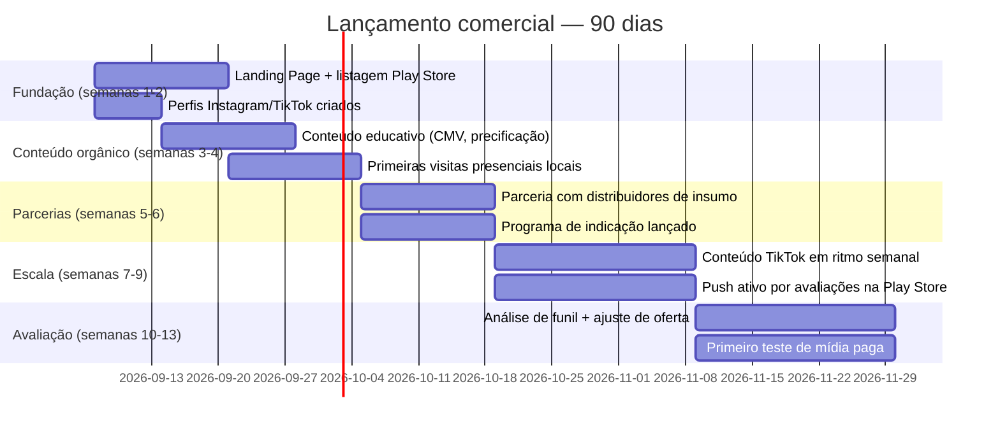

# 13 — Monetização e Estratégia de Vendas (SaaS por Assinatura)

## Índice

1. [Estratégia de mercado](#1-estratégia-de-mercado)
2. [Estrutura dos planos](#2-estrutura-dos-planos)
3. [Limites inteligentes](#3-limites-inteligentes)
4. [Precificação](#4-precificação)
5. [Estratégia Freemium](#5-estratégia-freemium)
6. [Funil de vendas](#6-funil-de-vendas)
7. [Estratégia de lançamento — 90 dias](#7-estratégia-de-lançamento--90-dias)
8. [Receita recorrente projetada](#8-receita-recorrente-projetada)
9. [Tela de comparação de planos](#9-tela-de-comparação-de-planos)
10. [Conclusão estratégica](#10-conclusão-estratégica)

> **Nota de mescla (leitura obrigatória antes de qualquer decisão de preço):** este documento **não é um plano de monetização genérico** — foi construído em cima do que já está escrito e do que já está em produção no restante do pacote (`01_PRD.md`, `02_PERSONAS.md`, `07_DATABASE.md`, `10_ROADMAP.md`, `11_BACKLOG.md`) e do estado real do projeto. Fatos do estado real que mudam decisões concretas de monetização abaixo, e por isso são repetidos aqui em vez de assumidos:
>
> 1. **V1 está em produção** (fichas técnicas Bar/Cozinha, booking em PDF, LGPD) — pode virar recurso Free/Basic hoje, sem depender de nada novo.
> 2. **Estoque, Equipe/RBAC, CMV automático e Preço sugerido (Épicos 06, 07 e 08) estão implementados e mergeados em `master`** (PRs #5, #6, #7) — não mais "em desenvolvimento numa branch": a build de teste ponta a ponta distribuída em 7–8/set/2026 já tem tudo isso funcionando. Status atualizado pra **✅ Implementado** em todo este documento (era 🚧/🔜 na v1.0, escrita um dia antes do merge). O que continua real é que **nenhuma linha de `recipe_cost_snapshot` tem em produção ainda** (0 linhas no banco, checado em 8/set) — ou seja, o recurso existe e está no ar, mas nenhum estabelecimento real gerou o dado ainda. É "sem uso real", não "sem implementação" — a v1.0 confundia as duas coisas, e isso mudava a decisão de sequenciamento comercial mais importante do documento (§10.4, ver correção lá).
> 3. **V3, Épico 09 (Produção) também já está em `master`** — registrar produção baixa estoque automaticamente. Não estava previsto neste documento na v1.0; entra na tabela de planos (§2) nesta revisão.
>
> Convenção de status usada em todo este documento, consistente com o restante do pacote: **✅ Implementado** (em produção/`master`) · **🚧 Em desenvolvimento** (código existe, ainda não mergeado) · **🔜 Planejado** (ainda não iniciado) · **💡 Novo** (proposto por este documento, ainda não existe em nenhum backlog — precisa ser adicionado a `11_BACKLOG.md` e aprovado como as demais histórias antes de virar compromisso de prazo).
>
> **Nenhuma infraestrutura de cobrança existe ainda — este documento continua sendo só estratégia, não uma feature em construção.** Não há campo de plano em `companies`, tabela de assinatura, integração de pagamento nem lógica de bloqueio em nenhum lugar do app hoje. O que falta pra sair do papel está detalhado como Épico 14 em `11_BACKLOG.md` §6, incluindo uma decisão bloqueante (qual provedor de IAP) equivalente ao spike que a V2 teve antes do Estoque.

---

## 1. Estratégia de mercado

### 1.1 Tamanho do mercado

Os números abaixo são dados públicos e datados — não estimativas de terceiro sem fonte, na mesma disciplina já usada em `01_PRD.md` §6 ("hipótese de mercado... a validar com dados de aquisição reais").

| Indicador | Valor | Fonte |
|---|---|---|
| Faturamento do setor de alimentação fora do lar no Brasil (2025) | R$ 495 bilhões (vs. R$ 455 bilhões em 2024) | [Abrasel / Pesquisa Mensal de Serviços (IBGE)](https://abrasel.com.br/noticias/noticias/bares-e-restaurantes-faturaram-mais-em-2025-diz-pesquisa-de-servicos/) |
| Estabelecimentos ativos de foodservice no Brasil | ~1,5 a 1,6 milhão de CNPJs ativos (CNAEs 56.11-2 e 56.12-1) | [Receita Federal, via OndeAbrir](https://ondeabrir.com/blog/quantos-restaurantes-tem-no-brasil) · [Instituto Foodservice Brasil / Driva](https://mercadoeconsumo.com.br/04/10/2023/foodservice/brasil-possui-16-milhao-de-estabelecimentos-ativos-no-foodservice/) |
| — dos quais, Lanchonetes | ~227 mil unidades (maior segmento) | Instituto Foodservice Brasil / Driva |
| — dos quais, Bares | ~144 mil unidades | Instituto Foodservice Brasil / Driva |
| — dos quais, estabelecimentos de menu variado (inclui grande parte dos restaurantes) | ~85 mil unidades | Instituto Foodservice Brasil / Driva |

**Dark kitchens:** não existe uma contagem oficial consolidada e específica — é um segmento novo demais e operacionalmente heterogêneo (algumas são CNPJ próprio, outras operam dentro da cozinha de um restaurante existente) para ter um CNAE dedicado nas fontes acima. Este documento trata dark kitchens como uma **cauda emergente dentro do total de ~1,6 milhão**, não uma fatia numerada à parte — validar tamanho real com dados de aquisição do próprio funil (`01_PRD.md` §6), não com uma cifra inventada.

**Leitura estratégica:** mesmo capturando uma fração de 1% desse universo de ~1,6 milhão de estabelecimentos, o produto endereça um mercado maior do que qualquer meta de receita tratada neste documento (§8) — o gargalo real não é tamanho de mercado, é execução de aquisição e retenção, exatamente o que as seções seguintes tentam resolver com disciplina.

### 1.2 Persona por segmento de negócio

`02_PERSONAS.md` já documenta 5 personas por **papel dentro do estabelecimento** (Proprietário, Chef, Bartender, Gerente, Cozinheiro). Este documento complementa — não substitui — com uma leitura por **tipo de negócio**, porque a decisão de compra de uma assinatura muda conforme o segmento, mesmo quando o papel de quem decide é sempre o Proprietário/Gerente ("Roberto"/"Patrícia").

| Segmento | Perfil típico | Dor dominante | O que usa hoje | Gatilho de compra |
|---|---|---|---|---|
| **Bares** | 1-2 unidades, cardápio de drinks autorais grande, equipe rotativa | Perder receita de drink quando um bartender-chave sai; preço "no olho" | Caderno, grupo de WhatsApp, planilha solta | Ver o CMV real de um drink autoral pela primeira vez |
| **Restaurantes** | Cardápio maior, múltiplos cozinheiros, pratos com mais ingredientes | Custo de prato complexo é difícil de calcular na mão; padronização de preparo entre turnos | Planilha de Excel manual, ficha em papel na cozinha | Sentir que está "vendendo no escuro" quando o custo de insumo sobe |
| **Hamburguerias** | Cardápio enxuto, alta repetição de poucos itens, margem sensível ao preço da carne/pão | CMV de commodity varia mês a mês e corrói a margem sem ninguém perceber a tempo | PDV genérico sem ficha técnica de verdade | Alerta de que o preço do insumo mudou e o preço de venda não acompanhou |
| **Cafeterias** | Ticket médio baixo, alto volume, itens simples (bebida + item de padaria) | Estoque de insumo perecível (leite, pão) com ruptura ou perda frequente | Contagem visual, "no olho", sem registro | Perceber quanto está perdendo em insumo vencido/estragado |
| **Lanchonetes** | Maior segmento em quantidade (~227 mil no Brasil), operação enxuta, dono também opera o caixa | Zero tempo para aprender ferramenta complexa; preço de venda copiado do concorrente, não calculado | Nada, ou um app de PDV básico sem ficha técnica | Onboarding de menos de 3 minutos e valor visível no primeiro uso |
| **Dark kitchens** | Sem salão físico, depende 100% de canal de delivery, múltiplas marcas na mesma cozinha | Margem já espremida pela taxa do delivery — cada centavo de CMV mal calculado dói mais | Planilha própria, às vezes nenhuma ficha técnica formal | Precisar defender preço/margem para o próprio marketplace de delivery |

### 1.3 Principais dores (transversais a todos os segmentos)

Reaproveitando e estendendo `01_PRD.md` §3 com a lente de monetização — a dor de gestão (coluna esquerda de `01_PRD.md`) é o que justifica o produto existir; a dor abaixo é o que justifica **pagar** por ele:

| Dor de gestão (já documentada) | Dor de conversão (nova, específica de venda por assinatura) |
|---|---|
| Preço decidido "no olho" | Desconfiança de assinatura recorrente ("mais uma mensalidade") sem ter visto valor primeiro |
| Ficha técnica em caderno/planilha | Medo de "pagar por algo que não vou usar" — baixa afinidade tecnológica torna qualquer compromisso financeiro arriscado até ser provado |
| Estoque contado de cabeça | Ciclo de caixa apertado de pequeno negócio — qualquer preço acima de ~R$ 100/mês precisa de justificativa muito clara de retorno |
| Compra por achismo | Concorrência de sistemas de PDV que já cobram caro por módulos que o dono não usa — gera resistência a "mais um sistema" |

### 1.4 Diferenciais competitivos

O Booking Chef não compete de frente com Colibri/Goomer (que venceram no segmento de **PDV** — maquininha, comanda, integração fiscal — e cobram caro por isso, servindo negócios já maiores). Ele compete no espaço que esses sistemas tratam como módulo secundário: **ficha técnica como dado central, mobile-first, sem exigir trocar o sistema de vendas que o estabelecimento já usa.**

- **Preço de entrada muito mais baixo** que um PDV completo, porque não inclui hardware, integração fiscal nem suporte de instalação presencial.
- **Adoção sem fricção de troca** — não substitui o PDV existente, complementa; o proprietário não precisa "migrar" nada para começar a usar.
- **Ficha técnica como cidadã de primeira classe**, não um módulo esquecido dentro de um ERP genérico (mesmo diferencial já registrado em `01_PRD.md` §7).
- **UX desenhada para baixa afinidade tecnológica** (heurísticas de Nielsen aplicadas, `04_UX_GUIDELINES.md`) — os concorrentes de PDV são desenhados para operador de caixa treinado, não para o dono sozinho às 23h organizando o cardápio.

### 1.5 Proposta de valor

> **"O Booking Chef mostra, em poucos minutos e sem precisar de um contador ou um sistema caro, quanto cada prato ou drink realmente custa — e por quanto ele deveria ser vendido."**

| Dor | Recurso que resolve | Resultado para o negócio |
|---|---|---|
| Preço "no olho" | CMV automático + preço sugerido (Premium) | Margem real, não estimada |
| Receita perdida quando funcionário sai | Ficha técnica centralizada (Free/Basic) | Continuidade operacional |
| Estoque sem controle | Estoque + alerta de mínimo (Basic/Premium) | Menos ruptura, menos perda |
| Treinar equipe nova | Booking em PDF (Free/Basic) | Onboarding de funcionário sem depender só de explicação verbal |

---

## 2. Estrutura dos planos

> Tabela no formato pedido, seguida da justificativa de cada linha — o "porquê" nunca é estético, é sempre uma aposta de retenção ou conversão explicada em §2.1–§2.4. Status de cada recurso conforme a convenção da Nota de mescla acima.

| Recurso | Free | Basic | Premium |
|---|---|---|---|
| Cadastro de produtos (fichas técnicas) ✅ | Até 15 fichas ativas | Até 100 fichas ativas | Ilimitado |
| Estoque de insumos ✅ | — | Básico (cadastro, movimentação, alerta de mínimo) | Completo (+ fornecedor vinculado por insumo) |
| Ficha técnica (Bar + Cozinha, com foto) ✅ | Completa, dentro do limite acima | Completa | Completa |
| Cálculo automático de CMV ✅ | — | — | Sim, em tempo real |
| Precificação por margem / preço sugerido ✅ | — | — | Sim (mínimo, ideal, premium) |
| Registro de produção (baixa automática de estoque) 🚧 | — | Sim | Sim + histórico ilimitado (ver linha de Histórico) |
| Histórico (custo, preço, movimentação, produção) | 7 dias | 30 dias | Ilimitado |
| Relatórios | — | Básicos (estoque atual, fichas cadastradas) | Avançados (CMV médio, insumos críticos, comparação por período) |
| Dashboard 🔜 | — | Indicadores essenciais | Completo (todos os indicadores de `01_PRD.md`, CU-10) |
| Exportação PDF (Booking) ✅ | Com marca d'água, até 3/mês | Sem marca d'água, ilimitado | Sem marca d'água, ilimitado + capa personalizada |
| Exportação Excel 💡 | — | — | Sim |
| Backup em nuvem | Automático (padrão da infraestrutura) | Automático | Automático + exportação sob demanda para download local |
| Multiusuário ✅ | 1 usuário (proprietário) | Até 3 usuários | Ilimitado |
| Auditoria de estoque 🔜 | — | — | Trilha completa (`audit_logs`, V3) |
| Inventário por QR Code 💡 | — | — | Leitura de código para conferência rápida |
| IA para sugerir preço 💡🔜 | — | — | Add-on, quando disponível (decisão de produto em aberto, `10_ROADMAP.md`) |
| Controle de perdas ✅ | — | Registro de perda | + Relatório de perda por período/insumo |
| Metas de CMV 💡 | — | — | Meta % por categoria/produto, com alerta de desvio |
| Custos indiretos 💡 | — | — | Rateio simples (%) sobre o custo direto — **não** é módulo financeiro (permanece fora do escopo definido em `01_PRD.md` §12) |
| Fornecedores ✅ | — | Cadastro simples | Vinculado ao insumo + histórico de preço por fornecedor |

> **Legenda de status corrigida nesta revisão (v1.1):** Estoque, CMV automático, Precificação, Multiusuário, Controle de perdas e Fornecedores eram 🚧 (Estoque/Multiusuário/Perdas/Fornecedores) ou 🔜 (CMV/Precificação) na v1.0 — hoje estão ✅, mergeados em `master`. Produção é novo nesta revisão, ainda 🚧: código pronto e testado (`tsc`/jest limpos), mas em PR aberto (#8), não mergeado em `master` ainda. Nenhuma dessas mudanças de status altera qual coluna (Free/Basic/Premium) tem o recurso — só corrige se o recurso **existe** ou não, que é uma pergunta diferente de "em qual plano ele deveria estar".

### 2.1 Por que a ficha técnica fica (parcialmente) no Free

A ficha técnica é o dado central do produto (`01_PRD.md` §7) — escondê-la atrás de paywall mataria a prova de valor antes que ela aconteça. Mas um limite de 15 fichas ativas é deliberado: dá para organizar o cardápio de um bar pequeno de verdade (não é uma demo capada em 3 itens), mas não dá para rodar a operação completa de um restaurante com cardápio maior sem sentir o limite — a fricção aparece exatamente quando o negócio já provou valor pra si mesmo, não antes.

### 2.2 Por que CMV era tratado à parte do resto do Premium (histórico — resolvido na v1.1)

Na v1.0, CMV automático e preço sugerido ainda não existiam em `master`, e a regra era "nunca vender como incluído algo que não roda de verdade" (mesmo princípio de honestidade de status do resto do pacote). Isso deixou de ser um problema de sequenciamento: os dois já estão implementados e testados em produção — a regra em si continua válida (nunca vender o que não existe), só não se aplica mais a esse par específico. Ver §10.4 para o que isso muda na estratégia de lançamento.

### 2.3 Por que Multiusuário é Basic e não Premium

Equipe/RBAC já está implementada e mergeada (convite, papéis, RLS por função — `07_DATABASE.md`). Colocar "até 3 usuários" no Basic (não no Free) segue a mesma lógica do Conta Azul/Nibo: múltiplos usuários é o gatilho de upgrade mais forte para um negócio pequeno que **cresceu** — o dono que só operava sozinho vira o dono que agora tem um gerente e precisa dar acesso limitado. É um limite que se resolve sozinho quando o negócio do cliente cresce, não um limite artificial.

**Ponto em aberto, não resolvido por este documento:** hoje não existe nenhuma checagem de limite na Edge Function `invite-employee` — o quarto convite de um plano Basic seria aceito normalmente pelo backend atual. Aplicar esse limite de verdade é trabalho do Épico 14 (`11_BACKLOG.md` §6), não uma mudança de regra de negócio.

### 2.4 Por que os recursos 💡 (novos) não entram no roadmap sem passar pelo backlog

Exportação Excel, Metas de CMV, Custos indiretos e Inventário por QR Code são propostas deste documento, não compromissos já assumidos em `11_BACKLOG.md`. Eles aparecem na coluna Premium porque justificam o preço mais alto *na estratégia comercial*, mas cada um precisa virar uma história (Épico, story points, critério de aceite BDD) antes de virar prazo — a mesma disciplina que evitou estimativas fantasiosas no resto do pacote.

### 2.5 Por que Produção segue o mesmo plano de Estoque

Registrar produção só faz sentido pra quem já tem Estoque ativo (é o que ele baixa) — colocá-lo num plano diferente criaria um recurso "incompleto sozinho". Fica de fora do Free pelo mesmo motivo de Estoque: é a segunda camada de valor, vendida depois que a ficha técnica (Free) já convenceu.

---

## 3. Limites inteligentes

O objetivo declarado do usuário é limites que **"incentivam upgrade sem impedir o uso real do app"** — cada limite abaixo foi calibrado para um uso real de pequeno negócio, não um número arbitrário para forçar a mão:

| Limite do plano Free | Valor | Por que esse número (não impede uso real, mas convida upgrade) |
|---|---|---|
| Fichas técnicas ativas | 15 | Cobre um cardápio enxuto de bar/lanchonete pequeno (o próprio segmento mais numeroso do mercado, §1.1); um restaurante ou bar com cardápio maior sente o limite exatamente quando já provou valor |
| Usuários | 1 (só o proprietário) | Um negócio unipessoal nunca esbarra nisso; o limite só aparece quando o negócio contrata alguém — ou seja, quando está crescendo, o melhor momento para vender |
| Exportação de booking (PDF) | 3 por mês, com marca d'água | Suficiente para testar o recurso mais visível do produto (treinar 1-2 funcionários novos por mês); a marca d'água nunca impede o uso, só sinaliza "versão gratuita" de forma visível e não punitiva |
| Histórico de alterações | 7 dias | Dá para corrigir um erro recente; não sustenta uma auditoria de longo prazo — decisão de negócio de mais peso puxa para Basic/Premium |
| Estoque e relatórios | Não disponíveis | Reservados para Basic (ver §2) — o Free prova o valor da ficha técnica primeiro; estoque é a segunda camada de valor, vendida depois que a primeira já convenceu |

Regra geral seguida em todos os limites: **nunca bloquear o que o usuário já criou** — se um cliente Basic com 80 fichas cair para Free por qualquer motivo, as fichas continuam visíveis e editáveis dentro do novo limite (o corte afeta criação de novas fichas, nunca apaga ou esconde dado já existente). É a mesma filosofia de soft-delete já aplicada em todo o produto (`09_SEGURANCA_LGPD.md` §5) — dado do cliente nunca é usado como refém.

> **Achado real (checado em produção, 8/set/2026), não hipotético:** já existem empresas no banco (contas de teste/piloto) com 93 e 22 fichas técnicas ativas — ambas acima do limite Free de 15, a de 93 abaixo do limite Basic de 100. Isso não é um cenário de "cliente que fez downgrade" (regra acima) — é o dia 1 do paywall encontrando conta que **nunca teve plano nenhum** já acima do limite que o plano padrão (Free) daria a ela. Sem uma migração explícita de "toda empresa existente antes do lançamento do paywall entra automaticamente como Basic (ou melhor) no dia da ativação, sem precisar pagar retroativo", a regra "nunca bloquear o que já existe" quebra na prática assim que o paywall for ligado. Isso é trabalho do Épico 14 (`11_BACKLOG.md` §6), não uma mudança nos números de limite em si.

---

## 4. Precificação

Valores em R$, benchmarkados abaixo de sistemas de PDV completo (Colibri/Goomer, que cobram por hardware+integração fiscal+suporte presencial) e na faixa de SaaS vertical brasileiro para pequeno negócio (Conta Azul, Nibo) — nunca acima do que o segmento mais numeroso do mercado (lanchonetes, §1.1) consegue pagar sem pensar duas vezes.

| Cenário | Basic (mensal) | Basic (anual) | Premium (mensal) | Premium (anual) | Desconto anual | Ticket médio (mix 70% Basic / 30% Premium) |
|---|---|---|---|---|---|---|
| **Conservador** | R$ 29,90 | R$ 299,00 (equivalente a R$ 24,92/mês) | R$ 59,90 | R$ 599,00 (equivalente a R$ 49,92/mês) | ~17% (2 meses grátis) | R$ 38,90/mês |
| **Ideal** (recomendado) | R$ 39,90 | R$ 399,00 (equivalente a R$ 33,25/mês) | R$ 79,90 | R$ 799,00 (equivalente a R$ 66,58/mês) | ~17% (2 meses grátis) | R$ 51,90/mês |
| **Premium (agressivo)** | R$ 49,90 | R$ 499,00 (equivalente a R$ 41,58/mês) | R$ 99,90 | R$ 999,00 (equivalente a R$ 83,25/mês) | ~17% (2 meses grátis) | R$ 64,90/mês |

### 4.1 Taxa de plataforma (Google Play Billing) — não descontada nos valores acima, nova nesta revisão

Os valores da tabela acima são o que o **cliente paga**, não o que o Booking Chef **recebe**. Como este é um app Android distribuído pela Play Store cobrando assinatura recorrente por acesso a recurso dentro do app, a política do Google exige que essa cobrança passe pelo Google Play Billing — não é opcional nem uma escolha de arquitetura, é regra de distribuição na loja. O Google retém uma parte de cada cobrança de assinatura:

| Tempo de assinatura ativa daquele assinante | Taxa do Google | Receita líquida sobre o cenário "Ideal" (ticket blendado R$ 51,90) |
|---|---|---|
| Primeiro ano | 15% | R$ 44,12/mês |
| A partir do 2º ano contínuo | 15% também (o corte pra 15% flat já é a política atual do Play — a antiga faixa de 30%→15% após o 1º ano só se aplicava a apps grandes; times pequenos/médios já entram direto em 15%) | R$ 44,12/mês |

Isso não muda o preço cobrado do cliente (§4 continua valendo como tabela de preço público) — muda a receita líquida real usada no cálculo de MRR/ARR/LTV/CAC (§8), que na v1.0 deste documento tratava o valor bruto como se fosse a receita da empresa. Ver §8 para os números corrigidos. Alternativa de arquitetura (fora do escopo de decidir aqui, mas registrada): uma camada como RevenueCat sobre o Play Billing simplifica a integração/analytics de assinatura, mas não reduz a taxa do Google — é custo de engenharia a mais, não desconto de taxa.

### Justificativa psicológica do preço

- **Terminação em ",90"** (charm pricing): reduz a percepção de valor arredondado para cima — R$ 39,90 é lido como "trinta e poucos", não "quase quarenta". Mesmo princípio já aplicado ao preço sugerido de venda dentro do próprio produto (`12_CRITERIOS_ACEITE.md` §5, "arredondamento comercial").
- **Teto psicológico abaixo de R$ 100/mês** em todos os cenários: para o público-alvo (pequeno negócio, ciclo de caixa apertado, §1.3), qualquer mensalidade de software que ultrapasse a casa dos R$ 100 exige uma aprovação mental mais formal ("isso é uma despesa séria"); abaixo disso, entra no orçamento como "mais um app", decisão rápida e de baixa fricção.
- **Efeito âncora/isca (decoy effect):** o Basic existe também para fazer o Premium parecer uma evolução natural e barata em termos relativos (dobro do preço por muito mais do que o dobro de valor percebido — CMV automático, preço sugerido, dashboard completo) — não para ser vendido como plano final, e sim como porta de entrada paga.
- **Desconto anual de ~17% (2 meses grátis), não um número redondo aleatório:** é o enquadramento mais comum e testado no mercado SaaS ("pague 10, leve 12") — reduz o churn ao prender o cliente por 12 meses de uma vez, e o valor entra como caixa antecipado (melhora fluxo de caixa da própria empresa que vende o Booking Chef, relevante para a meta de MRR em §8).
- **Cenário recomendado: "Ideal".** O "Conservador" deixa dinheiro na mesa frente ao valor real entregue (CMV + preço sugerido têm poder de decisão de preço do próprio negócio do cliente); o "Premium agressivo" arrisca o teto psicológico de R$ 100 sem dado de conversão real que justifique a aposta ainda — revisar depois de validar com os primeiros 100 clientes pagantes (§8).

---

## 5. Estratégia Freemium

**Inspiração declarada:** iFood (aquisição hiperlocal, presença física, cidade por cidade) para o funil de aquisição (§7); Conta Azul e Nibo (freemium por limite de uso, não por tempo, com upgrade guiado pelo próprio produto) para a mecânica de conversão abaixo.

### 5.1 Gatilhos de upgrade

| Gatilho | Momento em que acontece | O que é oferecido |
|---|---|---|
| 16ª ficha técnica | Ao tentar criar além do limite Free | "Você já cadastrou 15 fichas — seu cardápio está crescendo. Continue no Basic." |
| Tentativa de acessar Estoque | Ao tocar em uma tela bloqueada (visível, não escondida — heurística de visibilidade do sistema, `04_UX_GUIDELINES.md`) | Prévia da tela real, com cadeado e CTA de upgrade — nunca uma tela genérica de "recurso bloqueado" |
| Tentativa de convidar 2º usuário | Ao completar o formulário de convite no plano Free | "Seu plano atual permite só você. Convide sua equipe no Basic." |
| 4ª exportação de booking no mês | Ao tentar gerar o 4º PDF | Oferece remover o limite e a marca d'água |
| Primeiro CMV calculado (ver §5.4) | Momento de maior valor percebido, não de maior fricção | Oferta de trial Premium, não bloqueio |

### 5.2 Mensagens dentro do app

Tom consistente com a convenção de "mensagem amigável" já estabelecida em `04_UX_GUIDELINES.md` — nunca punitivo, sempre orientado a continuidade:

- ❌ Evitar: *"Limite atingido. Assine para continuar."*
- ✅ Usar: *"Seu negócio está usando bem o Booking Chef — 15 fichas já cadastradas! Para continuar cadastrando, dá uma olhada no plano Basic."*

### 5.3 Recursos bloqueados — como aparecem

Nunca escondidos da navegação (isso violaria a heurística de visibilidade do sistema já aplicada em todo o produto). Aparecem como prévia com cadeado — o usuário Free vê que Estoque e CMV existem e como se parecem, o que por si só já comunica o roadmap de valor do produto, sem exigir uma tela de vendas separada.

### 5.4 Trial Premium de 7 dias

- Ativado automaticamente ao concluir o onboarding (sem pedir cartão de crédito — pedir cartão nesse momento reduziria a ativação justamente no público de baixa afinidade tecnológica que este produto prioriza, §1.3).
- Aviso nos dias 5, 6 e 7 (push + mensagem no app), nunca surpresa no dia 8.
- No dia 8, downgrade automático para Free — nenhum dado é perdido (mesma regra de §3), só o acesso aos recursos Premium.

### 5.5 Momento ideal para oferecer a assinatura

Não é o cadastro (o usuário ainda não viu valor nenhum) e não é um limite batido no primeiro dia (ainda não teve tempo de confiar no produto). É o momento em que o usuário vê, pela primeira vez, um número de custo real calculado pelo produto — o "aha moment" descrito também no funil (§6). Oferecer a assinatura exatamente ali, no pico de valor percebido, converte muito mais do que qualquer notificação genérica.

---

## 6. Funil de vendas

| # | Etapa | Conversão da etapa anterior | Conversão acumulada (sobre Download) | O que provoca a conversão |
|---|---|---|---|---|
| 1 | Download | — | 100% | Anúncio, indicação, avaliação na Play Store, visita presencial (§7) |
| 2 | Cadastro | 60% | 60% | Onboarding rápido (CNPJ preenchido automaticamente, `01_PRD.md` CU-01) |
| 3 | Primeira ficha técnica | 55% | 33% | Fluxo de criação de ficha com poucos campos obrigatórios (`04_UX_GUIDELINES.md`) |
| 4 | Primeiro CMV calculado | 45% | 15% | Ingrediente vinculado ao estoque preenche custo automaticamente (história 07.1) |
| 5 | Primeiro relatório visto | 50% | 7,4% | Relatório básico já visível no Basic/trial |
| 6 | Oferta Premium exibida | 70% | 5,2% | Gatilho de upgrade no momento de maior valor percebido (§5.5) |
| 7 | Assinatura confirmada | 10% | 0,5% | Trial sem cartão + preço abaixo do teto psicológico (§4) |

> **Nota de sequenciamento real:** o enunciado original desta seção lista "Primeiro CMV" antes de "Primeira ficha técnica" — mantido acima na ordem de **etapas de funil de marketing**, mas é importante registrar que, tecnicamente, o CMV depende de uma ficha técnica já existir e ter ingrediente vinculado ao estoque (história 07.1/07.2, `12_CRITERIOS_ACEITE.md`) — ou seja, a ordem real de implementação em produto é ficha técnica → CMV, não o contrário. A tabela acima já reflete a ordem tecnicamente correta; o time de marketing deve comunicar a etapa 3→4 dessa forma, não na ordem literal do briefing original.
>
> **Origem dos números:** são benchmarks de mercado para funis de app B2B/prosumer no segmento SMB, não medições reais do Booking Chef — `01_PRD.md` §9 já registra que a instrumentação de eventos (`analytics_events`, evento `booking_generated`) ainda precisa ser implementada. Assim que existir, esta tabela deve ser substituída por dado real — mesma disciplina de "hipótese a validar" já usada em §1.1.

---

## 7. Estratégia de lançamento — 90 dias

Modelo de execução inspirado no playbook do iFood (presença física, hiperlocal, cidade por cidade) combinado com aquisição orgânica de baixo custo — coerente com "priorizar pequenos negócios" (o pequeno negócio confia mais em quem apareceu pessoalmente do que em anúncio pago genérico).



| Semanas | Foco | Ações concretas |
|---|---|---|
| 1–2 | Fundação | Landing Page no ar (proposta de valor de §1.5, captura de email/waitlist); ficha da Play Store com screenshots reais do booking em PDF; perfis Instagram/TikTok criados com bio e destaque para o diferencial de ficha técnica |
| 3–4 | Conteúdo + presença local | Conteúdo educativo semanal ("como calcular CMV de um drink", "3 erros de precificação de cardápio") no Instagram/TikTok; visitas presenciais a bares/restaurantes locais (o dono do negócio, §1.3, confia mais em demonstração ao vivo do que em anúncio) |
| 5–6 | Parcerias e indicação | Parceria com distribuidores de bebida/insumo (eles já visitam o mesmo público-alvo toda semana — canal de distribuição pronto, sem CAC de aquisição direta); programa de indicação lançado (cliente indica outro estabelecimento, ambos ganham 1 mês de Basic grátis) |
| 7–9 | Escala de conteúdo | Ritmo semanal de TikTok mantido (vídeos curtos de "bastidor de bar/cozinha usando o app"); push ativo por avaliações na Play Store (pedir avaliação logo após o momento de maior valor percebido, §5.5 — nunca no primeiro uso) |
| 10–13 | Avaliação e ajuste | Análise do funil real (§6) comparado ao benchmark assumido; ajuste de oferta/preço se a conversão etapa 6→7 divergir do esperado; primeiro teste controlado de mídia paga, só depois de confirmar que o funil orgânico já converte de forma saudável |

---

## 8. Receita recorrente projetada

Premissas do modelo (explícitas, para que qualquer investidor ou membro de equipe possa contestar ou recalibrar): cenário de preço "Ideal" (§4), ticket médio blendado de **R$ 51,90/mês bruto** (mix 70% Basic / 30% Premium); os números de clientes abaixo contam **apenas assinantes pagantes** (Basic + Premium) — usuários Free não entram na conta de MRR/ARR por definição. Churn mensal assumido começa mais alto que o benchmark de mercado maduro (3% a 7% ao ano, citado para SaaS B2B em estágio avançado) porque o produto está em estágio inicial e o público-alvo tem menor histórico de fidelidade a software — a melhoria de churn ao longo da escala reflete o próprio efeito das táticas de retenção descritas neste documento (§3, §5).

> **Correção desta revisão (v1.1):** a v1.0 usava o ticket bruto (R$ 51,90) direto no cálculo de LTV/CAC, sem descontar a taxa do Google Play Billing (§4.1, 15% sobre assinatura) — superestimando o quanto a empresa efetivamente pode gastar pra adquirir um cliente e ainda ter margem. MRR/ARR abaixo mantêm o bruto (é o número que o mercado/investidor espera ver como "tamanho do negócio"), mas ganharam uma coluna de **líquido** (o que realmente entra no caixa), e **LTV/CAC agora usam o ARPU líquido** (R$ 44,12/mês) — é o número certo pra decidir quanto vale a pena gastar adquirindo um cliente.

| Clientes pagantes | MRR bruto | MRR líquido (após -15% Play) | ARR bruto | Churn mensal assumido | LTV líquido (ARPU líquido ÷ churn) | CAC ideal líquido (LTV líquido ÷ 3) |
|---|---|---|---|---|---|---|
| 100 | R$ 5.190 | R$ 4.412 | R$ 62.280 | 6% (fase de validação, retenção ainda não madura) | R$ 735 | ≤ R$ 245 |
| 500 | R$ 25.950 | R$ 22.058 | R$ 311.400 | 5% (programa de indicação e onboarding já rodando, §7) | R$ 882 | ≤ R$ 294 |
| 1.000 | R$ 51.900 | R$ 44.115 | R$ 622.800 | 4,5% (base com histórico suficiente para retenção proativa) | R$ 980 | ≤ R$ 327 |
| 5.000 | R$ 259.500 | R$ 220.575 | R$ 3.114.000 | 4% (aproximando-se do benchmark de mercado maduro, com CMV automático/preço sugerido já em produção — ver §10) | R$ 1.103 | ≤ R$ 368 |

**Leitura de CAC:** o canal de visitas presenciais (§7) tem custo por aquisição mais alto que conteúdo orgânico — por isso a meta de CAC ideal deve ser lida como **blended** (média entre todos os canais), não um teto por canal individual. Um CAC líquido de R$ 245–368 (era R$ 288–433 sobre o bruto, na v1.0) é saudável mesmo para um canal presencial de custo mais alto, desde que o conteúdo orgânico e o programa de indicação (CAC quase zero) puxem a média para baixo.

---

## 9. Tela de comparação de planos

```
┌─────────────────────────────────────────────────────────────────┐
│                    Escolha o plano do seu negócio                │
│                                                                    │
│         [ Mensal ]        ( Anual — 2 meses grátis )             │
│                                                                    │
├───────────────────┬───────────────────┬───────────────────────────┤
│       FREE         │       BASIC        │   🔥 PREMIUM (mais escolhido) │
│      R$ 0           │    R$ 39,90/mês    │      R$ 79,90/mês          │
│                     │                     │                            │
│  ✅ Até 15 fichas    │  ✅ Até 100 fichas   │  ✅ Fichas ilimitadas       │
│  ✅ Booking c/marca  │  ✅ Booking s/marca  │  ✅ Booking personalizado  │
│     d'água (3/mês)  │     d'água          │                            │
│  🔒 Estoque          │  ✅ Estoque básico   │  ✅ Estoque completo       │
│  🔒 CMV automático   │  🔒 CMV automático   │  ✅ CMV automático         │
│  🔒 Preço sugerido   │  🔒 Preço sugerido   │  ✅ Preço sugerido         │
│  👤 1 usuário        │  👥 Até 3 usuários   │  👥 Usuários ilimitados    │
│  🔒 Relatórios       │  📊 Relatórios básicos│  📊 Relatórios avançados  │
│  🔒 Dashboard        │  📈 Indicadores      │  📈 Dashboard completo     │
│                     │     essenciais       │                            │
│                     │                     │                            │
│  [ Continuar Free ] │  [ Assinar Basic ]   │  [ Assinar Premium ]       │
│                     │                     │                            │
│  Já usa Basic ou Premium? Faça login →                              │
└─────────────────────────────────────────────────────────────────┘
```

Notas de design (herdadas das heurísticas de Nielsen já aplicadas em `04_UX_GUIDELINES.md`): recursos bloqueados usam 🔒 visível, nunca somem da tela (visibilidade do sistema); recursos ainda não lançados usariam ⏳ com "em breve" em vez de escondidos ou prometidos sem prazo (honestidade de status, mesma convenção ✅/🚧/🔜/💡 de todo o pacote) — mas isso deixou de se aplicar a CMV/Preço sugerido nesta revisão, porque eles já existem de verdade (ver Nota de mescla). O selo "🔥 mais escolhido" fica no Premium, não no Basic — efeito de ancoragem deliberado (§4) para guiar a decisão sem esconder as outras opções.

**Pendência real desta tela:** o mockup acima é só desenho — não existe nenhuma tela de comparação de planos no app hoje, nem os botões "Assinar Basic"/"Assinar Premium" fazem nada (não há integração de pagamento). Construir essa tela é uma história do Épico 14 (`11_BACKLOG.md` §6), não algo já pronto pra ativar.

---

## 10. Conclusão estratégica

### 10.1 O que fica Free para gerar valor

Ficha técnica (até 15, Bar + Cozinha, com foto) e booking em PDF (limitado, com marca d'água) — ambos **já implementados e validados em produção** (V1). É a prova de valor mais barata de entregar, porque já existe; não depende de nenhum desenvolvimento novo para sustentar a aquisição gratuita descrita em §7.

### 10.2 O que é exclusivo do Premium

CMV automático e preço sugerido (✅ implementados, ver Nota de mescla), dashboard completo, relatórios avançados, multiusuário ilimitado, fornecedores com histórico, auditoria de estoque, exportação Excel, metas de CMV e custos indiretos. Nesta revisão, a peça que mais define o valor do Premium (CMV + preço sugerido) **já existe em código e está em produção** — o que falta pra vender de verdade não é mais "o recurso não roda ainda" (era o caso na v1.0), é a ausência total de infraestrutura de cobrança (ver §10.4).

### 10.3 Qual plano tem maior potencial de conversão

O **Basic**. É o "sim fácil": resolve a dor mais dolorida e mais rápida de sentir (estoque + multiusuário) por um preço abaixo do teto psicológico de R$ 100 (§4). O Premium deve ser tratado como motor de **receita e LTV** (upsell natural depois que o cliente já confia no produto via Basic), não como motor de **volume** — a mesma lógica de expansão de PLG (product-led growth) usada por Conta Azul e Nibo: primeiro conquista pelo uso, depois expande pelo valor. Essa leitura não muda com a correção desta revisão — CMV/preço sugerido existirem não faz do Premium um plano de entrada mais fácil, o teto de preço continua sendo a barreira real pro "sim fácil" do Basic.

### 10.4 Estratégia para alcançar R$ 50.000 de MRR

Ao ticket médio blendado de R$ 51,90/mês bruto (§8), R$ 50.000 de MRR **bruto** exige aproximadamente **963 clientes pagantes**. Mas R$ 50.000 que efetivamente entram no caixa (líquido, depois da taxa do Google Play, §4.1/§8) exigem cerca de **1.134 clientes pagantes** (R$ 50.000 ÷ R$ 44,12 de ARPU líquido) — é essa segunda meta que deveria orientar runway/contratação, não a bruta. De todo modo, mesmo o número maior é pequeno frente ao mercado endereçável de ~1,6 milhão de estabelecimentos (§1.1), o que reforça que o gargalo é execução, não tamanho de mercado.

> **Sequenciamento reescrito nesta revisão — a v1.0 tinha "Fase A sem CMV → Fase B com CMV" como a decisão comercial mais importante do documento. Isso não se aplica mais: CMV/preço sugerido já estão prontos.** A pergunta que sobrou não é mais "quando o recurso fica pronto", é "quando existe infraestrutura pra cobrar por ele" — uma pergunta de engenharia (Épico 14), não de produto.

**Sequenciamento recomendado (versão v1.1):**

1. **Fase A — agora:** fechar a decisão bloqueante do Épico 14 (`11_BACKLOG.md` §6: qual provedor de IAP — Google Play Billing direto vs. uma camada como RevenueCat por cima) e construir o mínimo de infraestrutura de cobrança: campo de plano por empresa, tela de comparação de planos (§9), gating dos limites do Free (fichas/usuários/PDF, com a migração de grandfathering do §3 resolvida ANTES de qualquer conta pagar), integração de billing de verdade. Sem isso, nada deste documento pode virar cobrança real — não é uma opção de "lançar rápido", é o que falta literalmente para o botão "Assinar" fazer alguma coisa.
2. **Fase B — quando o Épico 14 estiver pronto:** lançar Free + Basic + Premium juntos, já com a promessa completa (não precisa mais de "acesso antecipado"/"em breve" — todos os recursos anunciados nos três planos já existem em código). Isso é uma simplificação real em relação à v1.0: uma fase a menos pra gerenciar comercialmente.
3. **Marcos de escala (referência, não compromisso de prazo — mesma cautela já usada em `10_ROADMAP.md`):** ~100 clientes pagantes nos primeiros meses via canais orgânicos e visitas presenciais (§7); ~500 com o programa de indicação e parcerias de distribuidor já maduros; ~1.000–1.134 pra bater R$ 50.000 de MRR líquido; a faixa de 5.000 clientes depende de repetir o mesmo ciclo de confiança-antes-de-cobrar em escala, não de um único canal de aquisição.

O maior risco deste plano deixou de ser "vender a Fase B antes da hora" (não existe mais Fase B de feature) — passou a ser **cobrar antes de existir onde cobrar**, ou pior, ligar limites de plano numa base de clientes que já está acima deles sem ter feito a migração de grandfathering primeiro (§3). Este documento existe para que essas linhas não sejam cruzadas por engano.

---

## Controle de versão

| Versão | Data | Mudança |
|---|---|---|
| 1.0 | 7 de setembro de 2026 | Primeira versão do plano de monetização e vendas, mesclada com `01_PRD.md`, `02_PERSONAS.md`, `07_DATABASE.md`, `10_ROADMAP.md` e `11_BACKLOG.md`, e com o estado real de desenvolvimento (Estoque/Equipe em desenvolvimento avançado; CMV automático e preço sugerido ainda não implementados). |
| 1.1 | 8 de setembro de 2026 | Correção estrutural após checar o documento contra o estado real do banco/código (`master`) e o código-fonte: (1) status de Estoque/Equipe/CMV/Preço sugerido atualizado de 🚧/🔜 pra ✅ — mergeados em `master` um dia depois da v1.0 — e Produção (V3, Épico 09) adicionado como 🚧; (2) §10.4 reescrito — a sequência "Fase A sem CMV → Fase B com CMV" não se aplica mais, o gargalo real virou infraestrutura de cobrança (Épico 14, novo em `11_BACKLOG.md` §6), não feature; (3) §4.1 novo — taxa do Google Play Billing (15%) descontada em MRR/ARR/LTV/CAC líquidos (§8), que a v1.0 calculava só sobre o valor bruto; (4) §3 — achado real de duas empresas em produção já acima do limite Free proposto (93 e 22 fichas ativas), exigindo migração de grandfathering antes de qualquer ativação de paywall; (5) confirmado que nenhuma infraestrutura de cobrança/plano/gating existe no app ou no banco hoje — nota adicionada à Nota de mescla. |
