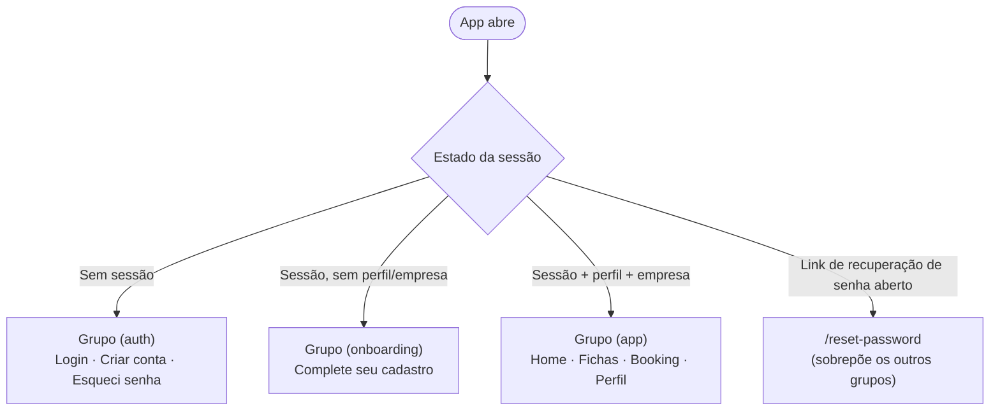
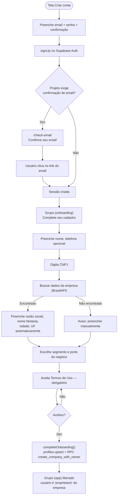
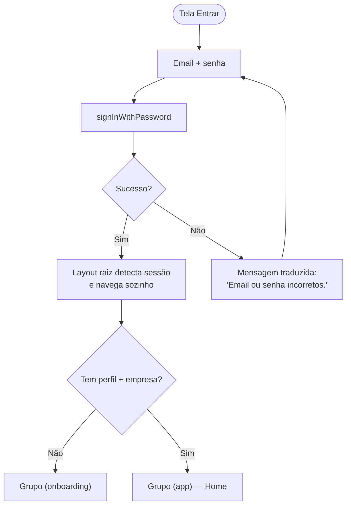
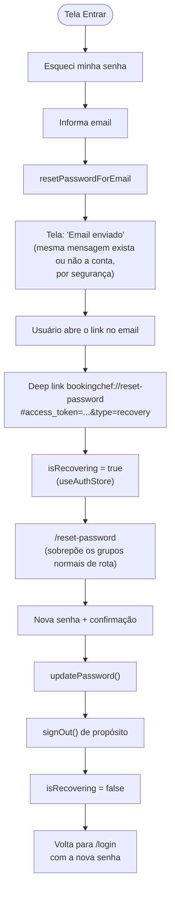
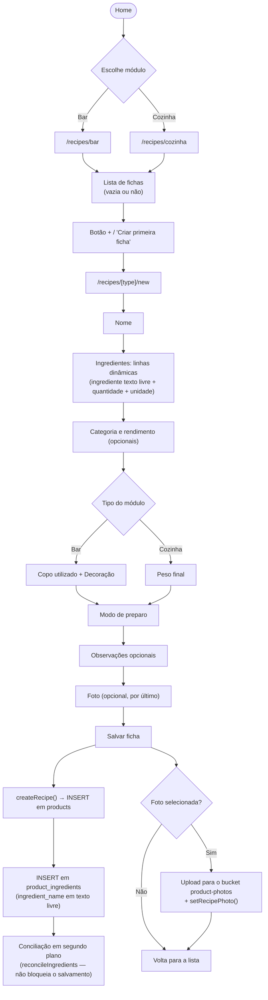
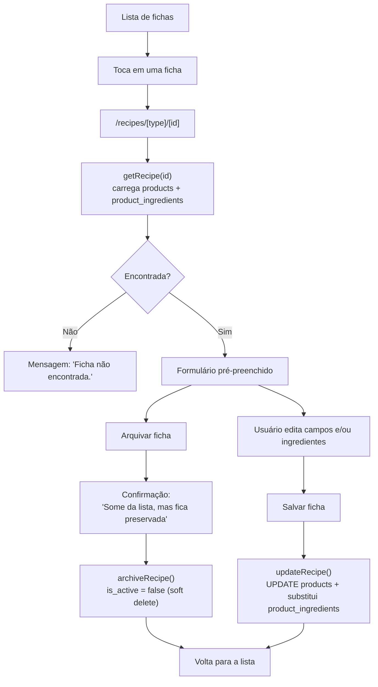
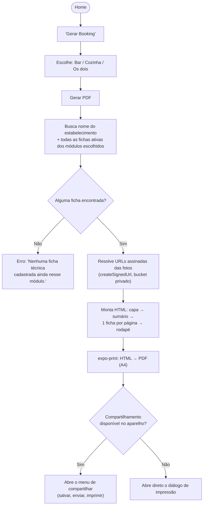
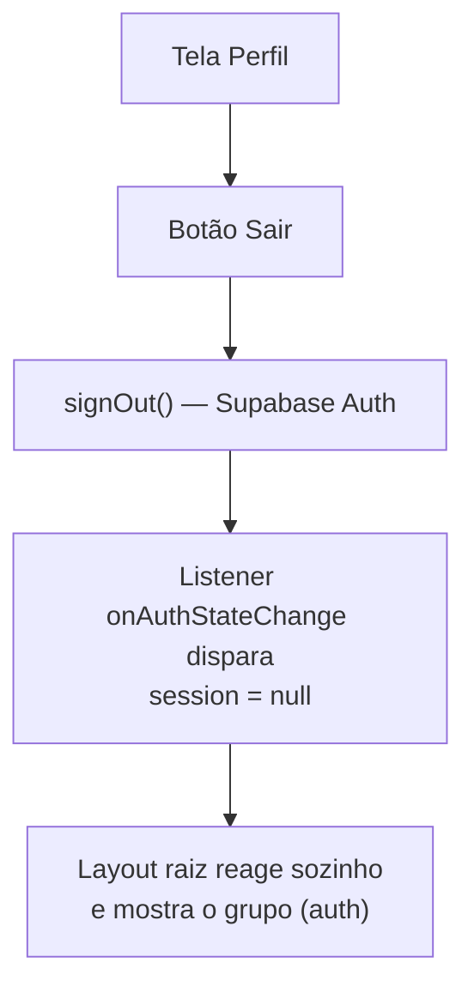
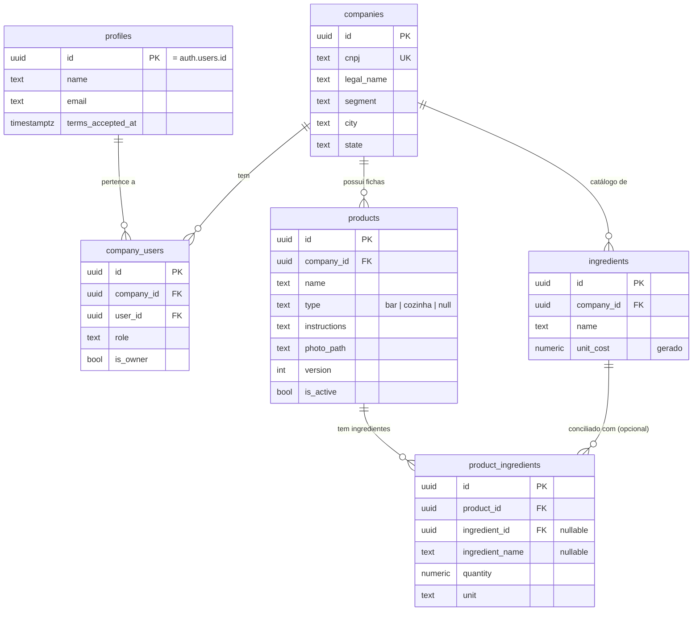
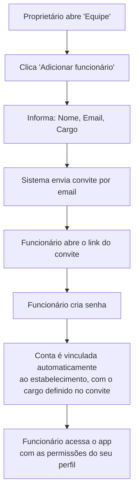

# Booking Chef — Documentação Oficial do Produto

**Versão do documento:** 1.0 · **Versão do app documentada:** 0.0.1 (MVP) · **Data:** 30 de agosto de 2026

> Este documento é a referência oficial do Booking Chef: o que o produto é, como foi construído, por que foi construído assim, e para onde vai. Ele reflete o estado real do código-fonte no momento da escrita (projeto `mobile/`, backend Supabase `barcontrol-dev`) — não um plano hipotético. Onde algo ainda não existe, o documento diz isso explicitamente.

---

## Sumário

1. [Visão Geral](#1-visão-geral)
2. [Arquitetura](#2-arquitetura)
3. [Fluxo do Usuário](#3-fluxo-do-usuário)
4. [UX](#4-ux)
5. [Banco de Dados](#5-banco-de-dados)
6. [Segurança](#6-segurança)
7. [Design System](#7-design-system)
8. [API Interna](#8-api-interna)
9. [Estrutura de Pastas](#9-estrutura-de-pastas)
10. [Critérios de Qualidade](#10-critérios-de-qualidade)

**Roadmap — Fase 2:** [Booking Chef 2.0 — Gestão Inteligente](#roadmap--fase-2-booking-chef-20--gestão-inteligente)

**Anexo:** [Backlog Priorizado (MoSCoW)](#backlog-priorizado-moscow)

---

## 1. Visão Geral

### 1.1 Objetivo

O Booking Chef é um aplicativo mobile que ajuda bares, restaurantes e estabelecimentos similares a organizar suas **fichas técnicas de cozinha e bar** — receitas, modo de preparo, ingredientes, rendimento, foto — e a transformar esse acervo em um **booking em PDF pronto para impressão**, o material que hoje normalmente vive em cadernos, planilhas soltas ou na memória de quem cozinha.

O produto resolve deliberadamente **um problema só, e bem**: tirar a ficha técnica do papel/planilha e colocá-la num lugar organizado, com geração de material de apresentação em PDF. Ele não tenta ser um ERP — não há PDV, controle fiscal, delivery ou módulo financeiro completo no MVP (v0.0.1). Essa disciplina de escopo é intencional (ver §1.4).

### 1.2 Público-alvo

- **Proprietários** de bares, restaurantes, lanchonetes, hamburguerias, pizzarias, adegas, cafeterias, food trucks e casas noturnas — segmentos já mapeados no cadastro do estabelecimento (capítulo 5).
- **Chefs e cozinheiros**, donos do módulo Cozinha (fichas técnicas de pratos: modo de preparo, peso final).
- **Bartenders**, donos do módulo Bar (fichas técnicas de drinks: copo utilizado, decoração).
- **Gerentes**, que frequentemente circulam entre os dois módulos.

O desenho de produto prioriza explicitamente **pessoas com pouca afinidade tecnológica**: telas curtas, uma ação óbvia por tela, vocabulário do dia a dia do estabelecimento (nunca termos de banco de dados ou de TI), e nenhuma etapa que exija entender conceitos abstratos (como "cadastrar um insumo antes de poder usá-lo" — ver a decisão de ingrediente em texto livre, §1.4).

### 1.3 Problema que resolve

| Antes do Booking Chef | Com o Booking Chef |
|---|---|
| Ficha técnica em caderno, planilha solta ou só na cabeça de quem cozinha | Ficha técnica centralizada, por estabelecimento, com histórico de edição |
| Treinar um novo funcionário exige alguém explicar a receita pessoalmente | Booking em PDF, com fotos e modo de preparo, pronto para consulta/impressão |
| Bar e cozinha misturados ou em lugares diferentes | Separação clara entre módulo Bar e módulo Cozinha, com campos específicos de cada um |
| Sem padrão de apresentação para investidores, franquias ou auditorias | Booking com capa, sumário e uma ficha por página, no padrão A4 |

### 1.4 Diferenciais

- **Geração de booking em PDF já no MVP.** Não é um "recurso futuro": é o diferencial competitivo do produto, por isso entrou na v1 junto com o cadastro de fichas, e não depois (decisão registrada em `FASE1-ARQUITETURA-MOBILE.md`, seção 1).
- **Ingrediente 100% texto livre.** O usuário digita o nome do ingrediente como se estivesse escrevendo à mão — sem precisar cadastrar um "insumo" antes, sem tela de busca no meio do caminho. Essa é uma decisão de UX deliberada para o público pouco técnico: nenhuma etapa extra é imposta na ficha técnica. Por trás da simplicidade, uma rotina de conciliação (ver §1.5 e capítulo 5) já casa esses nomes digitados com um catálogo de insumos — preparando o terreno para custo/CMV sem que o usuário precise fazer nada a mais hoje.
- **Bar e Cozinha como o mesmo aplicativo, com identidades separadas.** Mesma tela de lista e mesmo editor de ficha, mas com campos condicionais (copo e decoração no Bar; peso final na Cozinha) e navegação separada a partir da Home.
- **Construído sobre uma base já validada em produção.** O backend (Supabase) não foi criado do zero para este app — é o mesmo projeto real que já atende um sistema de estoque e cardápio digital para bares (ver §1.6), com isolamento entre empresas (multi-tenant) já testado com dados reais.
- **LGPD como característica de produto, não rodapé jurídico.** Termos de Uso e Política de Privacidade são passos reais do fluxo de cadastro (com aceite obrigatório) e a exclusão de conta é uma função completa, executada por uma Edge Function dedicada (`delete-account`) que apaga em cascata a empresa, as fichas e as fotos — não um formulário de contato "peça para excluírem seus dados".

### 1.5 O que o MVP (v0.0.1) já entrega

Todos os itens abaixo estão implementados, testados (`tsc --noEmit`, suíte Jest, `expo export`) e documentados neste texto — não são promessas:

- Cadastro do estabelecimento (onboarding com CNPJ validado e preenchimento automático via API pública).
- Login seguro via Supabase Auth (sessão persistida com `expo-secure-store`, nunca `AsyncStorage` puro).
- Recuperação de senha por link de email (deep link).
- Gestão completa de fichas técnicas: criar, editar, listar (com busca/filtro/ordenação), arquivar (soft delete).
- Separação entre módulo Bar e módulo Cozinha, com campos próprios de cada um.
- Upload de foto da ficha, em bucket de Storage privado.
- Geração de booking em PDF (capa, sumário, uma ficha por página, rodapé), com opção de gerar só Bar, só Cozinha, ou os dois.
- Conciliação automática de insumos em segundo plano (o texto livre digitado na ficha alimenta um catálogo de insumos, sem o usuário perceber — base para custo/CMV na Fase 2).
- LGPD: aceite de termos no cadastro, políticas acessíveis a qualquer momento, exclusão de conta completa e irreversível.
- UX orientada pelas heurísticas de Nielsen (capítulo 4), com preferência de tema claro/escuro/sistema.

### 1.6 Tecnologias

| Camada | Tecnologia | Papel |
|---|---|---|
| App mobile | **React Native + Expo** (SDK 57) | Runtime multiplataforma (Android/iOS), build gerenciado via EAS |
| Linguagem | **TypeScript** | Tipagem estática em 100% do código do app |
| Navegação | **Expo Router** | Roteamento por arquivos, com grupos protegidos por estado de autenticação |
| Estado global | **Zustand** | Sessão/perfil/empresa (`auth`) e preferência de tema (`theme`) |
| Formulários | **React Hook Form** + **Zod** (via `@hookform/resolvers`) | Validação client-side e tipagem inferida do schema |
| Estilo | **NativeWind** (Tailwind para React Native) | Classes utilitárias, suporte nativo a `dark:` |
| Backend | **Supabase** (Postgres + Auth + Storage + Edge Functions) | Banco, autenticação, arquivos e função serverless de exclusão de conta |
| Sessão segura | **expo-secure-store** | Keychain (iOS) / Keystore (Android) — nunca token em texto puro |
| Geração de PDF | **expo-print** + **expo-sharing** | HTML → PDF nativo, compartilhado ou impresso |
| Busca de CNPJ | **BrasilAPI** (pública, sem chave) | Preenchimento automático no onboarding, sempre com confirmação do usuário |
| Testes | **Jest** + **@testing-library/react-native** (via `jest-expo`) | Testes de validadores e regras de negócio puras |

O app reaproveita o **mesmo projeto Supabase real** (`barcontrol-dev`) que já serve um sistema web de controle de estoque e cardápio digital do mesmo grupo de produto — não um banco isolado criado só para o Booking Chef. Essa decisão está detalhada no capítulo 2 e tem implicações diretas no capítulo 5 (banco de dados).

---

## 2. Arquitetura

### 2.1 Visão geral

O Booking Chef é um app **client-heavy**: praticamente toda a lógica de negócio roda no dispositivo, em TypeScript, e fala diretamente com o Supabase via `@supabase/supabase-js` — não existe uma API própria (Node, etc.) no meio do caminho. As únicas exceções são:

1. **Regras que exigem privilégio elevado ou atomicidade no servidor** — implementadas como funções Postgres `SECURITY DEFINER` (ex.: `create_company_with_owner`) chamadas via RPC.
2. **A exclusão de conta**, que roda como uma **Edge Function** (`delete-account`), porque precisa apagar o usuário do Supabase Auth — operação que o client nunca pode fazer diretamente.

Toda a segurança de acesso a dados fica no banco, via **Row Level Security (RLS)** — o client nunca decide "posso ver isso?"; ele simplesmente não recebe de volta o que não pode ver. Isso é explicado em detalhe no capítulo 6.

### 2.2 Diagrama textual da arquitetura

```
┌─────────────────────────────────────────────────────────────────────┐
│                          DISPOSITIVO (Android/iOS)                    │
│                                                                         │
│  ┌───────────────────────────────────────────────────────────────┐   │
│  │                     App React Native (Expo)                     │   │
│  │                                                                   │   │
│  │  ┌───────────────┐   ┌──────────────────┐   ┌─────────────────┐ │   │
│  │  │  app/  (rotas)  │   │  src/components/  │   │  src/features/   │ │   │
│  │  │  Expo Router    │──▶│  UI reutilizável   │◀──│  auth/          │ │   │
│  │  │  (auth)         │   │  FormField, etc.   │   │  onboarding/     │ │   │
│  │  │  (onboarding)   │   └──────────────────┘   │  recipes/        │ │   │
│  │  │  (app)          │                           │  booking/        │ │   │
│  │  └───────┬─────────┘                           │  theme/          │ │   │
│  │          │                                      └────────┬────────┘ │   │
│  │          │           ┌──────────────────┐                │          │   │
│  │          └──────────▶│  src/validators/  │◀───────────────┘          │   │
│  │                       │  Zod schemas      │                          │   │
│  │                       └──────────────────┘                          │   │
│  │                                                                   │   │
│  │  ┌───────────────────────────────────────────────────────────┐  │   │
│  │  │  src/lib/supabase.ts — cliente único                          │  │   │
│  │  │  storage: expo-secure-store (chunked, Keychain/Keystore)      │  │   │
│  │  └──────────────────────────┬────────────────────────────────┘  │   │
│  └─────────────────────────────┼────────────────────────────────────┘   │
│                                  │ HTTPS (REST + Realtime + Storage)      │
└──────────────────────────────────┼──────────────────────────────────────┘
                                    ▼
┌─────────────────────────────────────────────────────────────────────┐
│                    SUPABASE — projeto `barcontrol-dev`                │
│                                                                         │
│  ┌────────────────┐  ┌──────────────────┐  ┌─────────────────────┐  │
│  │  Auth            │  │  Postgres          │  │  Storage             │  │
│  │  auth.users       │  │  schema public     │  │  bucket              │  │
│  │  JWT + Refresh    │  │  RLS em toda tabela│  │  product-photos      │  │
│  │  Token            │  │  funções SECURITY  │  │  (privado, RLS por   │  │
│  │                  │  │  DEFINER (schema   │  │  company_id no path) │  │
│  │                  │  │  private)          │  │                      │  │
│  └────────────────┘  └──────────────────┘  └─────────────────────┘  │
│                                                                         │
│  ┌───────────────────────────────────────────────────────────────┐  │
│  │  Edge Functions (Deno)                                          │  │
│  │  delete-account  — exclusão de conta (LGPD)                     │  │
│  │  garcom-ai       — IA do cardápio digital web (fora do escopo    │  │
│  │                    do Booking Chef, mesmo backend compartilhado) │  │
│  └───────────────────────────────────────────────────────────────┘  │
└─────────────────────────────────────────────────────────────────────┘
                                    ▲
                                    │ (mesmo banco, tabelas compartilhadas)
┌─────────────────────────────────────────────────────────────────────┐
│         App web Next.js — estoque + cardápio digital (pausado)        │
│         Não faz parte do escopo desta documentação                    │
└─────────────────────────────────────────────────────────────────────┘
```

### 2.3 Por que reaproveitar o backend de outro app

O Booking Chef não nasceu com um banco próprio, criado do zero conforme um desenho inicial de tabelas simples (`establishments`, `users`, `recipes`, `ingredients`). Em vez disso, ele foi construído sobre um banco Postgres/Supabase **já em produção**, que atende um sistema web de estoque e cardápio digital do mesmo grupo. A tabela abaixo resume a decisão:

| Desenho inicial (documento-base) | O que já existia no banco real | Ganho de reaproveitar |
|---|---|---|
| `establishments` | `companies` | CNPJ único, multi-tenant e isolamento entre empresas (RLS) já testado com usuários reais |
| `users` com senha própria | `profiles` + `auth.users` (Supabase Auth) | Hash de senha, JWT e refresh token já resolvidos pela biblioteca — zero código de autenticação escrito à mão |
| `recipes` | `products` | Reaproveita uma tabela já com controle de versão (`version`, incrementado por trigger) e auditoria (`created_by`) |
| `ingredients` (texto livre, sem custo) | `ingredients` (catálogo por empresa, com `unit_cost` calculado) + `product_ingredients` | O caminho para custo/CMV (Roadmap Fase 2) já existe na estrutura — não precisa ser reconstruído |

Essa decisão tem um custo: os nomes de tabela e alguns campos não são os mais óbvios para quem lê o schema pela primeira vez pensando só em "ficha técnica" (por exemplo, uma ficha técnica é uma linha em `products`, não em uma tabela chamada `recipes`). O capítulo 5 documenta isso com precisão para eliminar essa fricção.

### 2.4 Camadas do app (`mobile/src/`)

| Camada | Responsabilidade |
|---|---|
| `app/` | Apenas rotas (Expo Router). Cada arquivo é uma tela; a lógica de negócio não mora aqui — é importada de `src/features/`. |
| `src/components/` | Componentes de UI puros e reutilizáveis, sem chamada de rede (`FormField`, `PrimaryButton`, `ModuleCard`, `RecipeCard`, etc.). |
| `src/features/<domínio>/` | Lógica de negócio por domínio: `auth`, `onboarding`, `recipes`, `booking`, `theme`. Cada pasta expõe funções (`api.ts`) que encapsulam as chamadas ao Supabase. |
| `src/validators/` | Schemas Zod — a única fonte de verdade sobre "o que é um dado válido" no app, compartilhada entre formulário e chamada de API. |
| `src/lib/` | Infraestrutura transversal — hoje, só o cliente Supabase. |
| `src/hooks/` | Hooks reutilizáveis entre telas (ex.: `useRecipePhotoUrl`). |
| `src/types/` | Tipos de domínio que não vêm de um schema Zod. |

Essa separação (rota fina → feature com a lógica → validador Zod como contrato) é o padrão obrigatório para qualquer tela nova — ver capítulo 10.

---

## 3. Fluxo do Usuário

Esta seção descreve, jornada por jornada, o caminho real que o usuário percorre no app — incluindo os desvios (email não confirmado, CNPJ não encontrado, ficha sem ingredientes) tratados no código.

### 3.1 Mapa geral de navegação

O layout raiz (`app/_layout.tsx`) decide, a cada momento, **qual dos três grupos de rotas** o usuário pode ver — nunca os três ao mesmo tempo. A decisão é puramente derivada de estado (sessão, perfil, vínculo com empresa), nunca de uma flag manual:



### 3.2 Cadastro (Criar conta → Onboarding)

Duas etapas propositalmente separadas: primeiro a **conta** (email/senha, resolvido 100% pelo Supabase Auth), depois o **onboarding** (dados da pessoa + dados do estabelecimento, numa tela só — o app mobile não usa o wizard de várias etapas que o app web tem, por não haver ganho de UX em fatiar isso em telas separadas no celular).



**Regras de negócio:**
- A busca de CNPJ **nunca grava nada sozinha** — só preenche o formulário; o usuário revisa e confirma ao enviar.
- A criação da empresa é atômica e só pode acontecer por uma função de banco (`create_company_with_owner`, `SECURITY DEFINER`) — não existe `INSERT` direto liberado nas tabelas `companies`/`company_users` para o client (ver capítulo 6).
- Quem completa o onboarding é sempre gravado como `proprietario` da empresa recém-criada; não há campo de "sua função" nesse formulário porque a função da RPC decide isso sozinha.
- Sem aceite dos Termos de Uso, o botão de concluir cadastro não avança (validação Zod: `termsAccepted` precisa ser `true`).

### 3.3 Login



Nenhuma tela chama `router.push` após um login bem-sucedido: a navegação é 100% reativa ao estado global de sessão (`useAuthStore`), evitando o app ficar "preso" numa tela errada se o estado mudar por outro caminho (ex.: o listener de autenticação do Supabase disparando em segundo plano).

### 3.4 Recuperação de senha

Este é o fluxo com mais cuidado de estado do app, porque envolve um **deep link vindo de fora do app** (o link do email):



**Por que faz logout depois de trocar a senha:** a sessão criada pelo link de recuperação é uma sessão especial, e manter o usuário "logado" nela seria misturar dois conceitos (recuperar acesso vs. sessão de uso normal). Deslogar e pedir um novo login com a senha nova é mais simples e mais seguro.

**Bug real encontrado e corrigido durante o desenvolvimento:** as rotas `reset-password`, `terms` e `privacy` estavam, numa versão anterior, declaradas incondicionalmente e *antes* dos três grupos protegidos no `Stack` do Expo Router. Como um `Stack` sem `initialRouteName` explícito usa a primeira tela do array como padrão, o app sempre abria em "Nova senha" — para qualquer usuário, sempre, não só durante uma recuperação de senha real. A correção reordenou o array para que os três grupos mutuamente exclusivos (`auth`/`onboarding`/`app`) venham primeiro, e `reset-password` só apareça no array (e vire tela padrão) quando `isRecovering` é de fato verdadeiro.

### 3.5 Criar ficha técnica



### 3.6 Editar ficha técnica

O mesmo formulário de criação é reaproveitado para edição — a tela detecta `id === "new"` vs. um id real e ajusta o comportamento (título, dados pré-carregados, botão de arquivar).



**Regra de negócio importante:** a ficha **nunca é apagada fisicamente**. "Arquivar" é sempre um `UPDATE is_active = false`. Isso preserva o histórico (relevante inclusive para o futuro `recipe_cost_snapshot` da Fase 2 — capítulo do Roadmap) e evita perda acidental de dados por parte de um usuário pouco técnico.

### 3.7 Gerar Booking (PDF)



**Regras do PDF:** fundo sempre branco e fotos sempre em escala de cinza — de propósito, para impressão em preto e branco funcionar bem mesmo que o dispositivo esteja em modo escuro. Todo texto do usuário (nome da ficha, ingredientes, modo de preparo) passa por *escaping* de HTML antes de entrar no PDF, prevenindo que caracteres como `<` ou `&` quebrem a renderização — o mesmo mecanismo também neutraliza uma tentativa de injeção de HTML/script via esses campos.

### 3.8 Logout



Assim como no login, não há navegação manual — o `signOut()` apenas limpa a sessão, e o roteador reage à mudança de estado.

---

## 4. UX

### 4.1 As 10 heurísticas de Nielsen aplicadas ao Booking Chef

Antes do detalhamento tela a tela, esta tabela resume **como o app atende cada heurística**, com exemplos concretos do código — não como um princípio abstrato.

| # | Heurística | Como o Booking Chef atende |
|---|---|---|
| 1 | Visibilidade do status do sistema | Todo botão que dispara uma chamada de rede tem estado de `loading` (`PrimaryButton` com spinner); a lista de fichas usa `RefreshControl` (puxar para atualizar) com o mesmo estado de `loading`; o splash screen só some depois que sessão e tema terminam de carregar. |
| 2 | Correspondência entre o sistema e o mundo real | Vocabulário do estabelecimento, não de banco de dados: "Ficha técnica", "Copo utilizado", "Modo de preparo", "Peso final" — nunca "produto", "registro" ou "item". Ícones com emoji (🍸 Bar, 👨‍🍳 Cozinha, 📖 Booking) reforçam o mapeamento sem depender de uma biblioteca de ícones abstrata. |
| 3 | Controle e liberdade do usuário | `BackButton` em praticamente toda tela secundária; "Arquivar" (não excluir) preserva a reversão pelo suporte; o formulário de ficha permite remover qualquer linha de ingrediente individualmente. |
| 4 | Consistência e padrões | Um único componente `FormField` para todo campo de texto do app; um único `PrimaryButton` com três variantes (`solid`/`outline`/`tone="danger"`) para toda ação; a mesma tela de lista atende Bar e Cozinha, só trocando o filtro — nenhuma duplicação visual entre os dois módulos. |
| 5 | Prevenção de erros | Validação Zod bloqueia o envio antes da chamada de rede (ex.: senha curta, CNPJ com dígito verificador inválido, email mal formatado); o botão "Concluir cadastro" não avança sem o aceite dos Termos; unidades de ingrediente são uma lista fechada (`kg/g/l/ml/un`), eliminando erro de digitação livre que antes existia. |
| 6 | Reconhecimento em vez de memorização | Onboarding preenche razão social/cidade/UF automaticamente a partir do CNPJ (BrasilAPI) — o usuário só confirma, não precisa lembrar/digitar de novo; a lista de fichas mostra categorias já usadas como chips clicáveis, em vez de exigir digitar um filtro. |
| 7 | Flexibilidade e eficiência de uso | Busca, filtro por categoria e ordenação (recentes/A-Z) na lista de fichas, tudo em memória (sem round-trip a cada tecla); botão flutuante de "criar nova ficha" sempre visível quando a lista não está vazia. |
| 8 | Estética e design minimalista | Uma ação primária óbvia por tela (o `PrimaryButton` principal); campos condicionais (copo/decoração vs. peso final) só aparecem quando fazem sentido para o módulo atual — nunca os dois conjuntos ao mesmo tempo. |
| 9 | Ajudar o usuário a reconhecer, diagnosticar e corrigir erros | Erros técnicos do Supabase são **traduzidos** para linguagem humana antes de chegar à tela (`translateError`, ex.: `"Invalid login credentials"` → `"Email ou senha incorretos."`); mensagens de erro aparecem embaixo do formulário, no lugar onde o usuário acabou de agir. |
| 10 | Ajuda e documentação | Placeholders e *hints* diretamente no campo (ex.: "Mínimo de 8 caracteres" abaixo do campo de senha); estados vazios sempre explicam o que fazer a seguir ("Você ainda não possui nenhuma ficha técnica" + botão "Criar primeira ficha"), em vez de uma tela em branco. |

Adicionalmente, todo alvo tocável no app respeita a área mínima de toque de **44×44px** (WCAG/heurística de acessibilidade), aplicada via classe utilitária `min-h-[44px]` em botões, links e opções de seleção — inclusive em elementos que visualmente parecem menores, como o "✕" de remover ingrediente.

### 4.2 Telas — objetivo, componentes, ações e estados

#### Login (`app/(auth)/login.tsx`)

- **Objetivo:** autenticar quem já tem conta, no menor número de toques possível.
- **Componentes:** `FormField` (email, senha com alternância de visibilidade), `PrimaryButton` ("Entrar" e "Criar conta" em variante `outline`), link de texto "Esqueci minha senha".
- **Ações principais:** entrar; ir para recuperação de senha; ir para criar conta.
- **Estado vazio:** não se aplica (formulário, não lista).
- **Estado de erro:** mensagem traduzida abaixo dos campos ("Email ou senha incorretos.") sem indicar qual dos dois campos está errado — decisão de segurança deliberada, para não revelar se o email existe.

#### Criar conta (`app/(auth)/signup.tsx`)

- **Objetivo:** criar as credenciais (email/senha) — nada de empresa aqui.
- **Componentes:** `BackButton`, `FormField` (email, senha com hint "Mínimo de 8 caracteres", confirmar senha).
- **Ações principais:** criar conta.
- **Estado vazio:** não se aplica.
- **Estado de erro:** senha curta ou senhas divergentes (bloqueado antes do envio, por Zod); "Já existe uma conta com esse email." (traduzido do erro do Supabase).

#### Confirme seu email (`app/(auth)/check-email.tsx`)

- **Objetivo:** explicar por que o usuário ainda não entrou, quando o projeto exige confirmação por email.
- **Componentes:** texto explicativo com o email informado interpolado; `PrimaryButton` outline "Voltar para o login".
- **Ações principais:** voltar ao login (depois de confirmar pelo email).
- **Estado vazio / erro:** não se aplica — é, ela mesma, uma tela de estado informativo.

#### Esqueci minha senha (`app/(auth)/forgot-password.tsx`)

- **Objetivo:** iniciar a recuperação sem exigir que o usuário lembre de mais nada além do email.
- **Componentes:** `FormField` (email), `PrimaryButton` "Enviar link".
- **Ações principais:** enviar o link de recuperação.
- **Estado "enviado":** troca a tela inteira por uma confirmação neutra ("Se existir uma conta com esse email, você vai receber um link...") — deliberadamente ambígua sobre a existência da conta, por segurança.
- **Estado de erro:** falha genérica de rede/serviço.

#### Nova senha (`app/reset-password.tsx`)

- **Objetivo:** permitir trocar a senha a partir do link de recuperação, e só nesse contexto.
- **Componentes:** `FormField` (nova senha, confirmar nova senha).
- **Ações principais:** salvar nova senha (e é deslogado automaticamente em seguida — ver §3.4).
- **Estado "concluído":** tela de sucesso simples antes de mandar para o login.
- **Estado de erro:** senha curta, senhas divergentes (Zod) ou falha do Supabase.

#### Complete seu cadastro / onboarding (`app/(onboarding)/company.tsx`)

- **Objetivo:** coletar os dados mínimos da pessoa e do estabelecimento para liberar o app.
- **Componentes:** `FormField` (nome, telefone, CNPJ, razão social, nome fantasia, cidade, UF), `PrimaryButton` outline "Buscar dados da empresa", `FormChipSelect` (segmento, porte do negócio), links para Termos/Privacidade, `FormCheckbox` (aceite dos termos, opt-in de marketing).
- **Ações principais:** buscar CNPJ (preenchimento automático); concluir cadastro.
- **Estado vazio:** não se aplica (formulário único).
- **Estado de erro:** "Digite um CNPJ válido antes de buscar." (validação local, sem round-trip); "Não encontramos esse CNPJ. Preencha os dados manualmente." (a busca falhou, mas o cadastro pode continuar); erro genérico ao concluir, se a RPC falhar (ex.: CNPJ duplicado, traduzido para "Já existe uma empresa cadastrada com esse CNPJ.").

#### Home (`app/(app)/index.tsx`)

- **Objetivo:** ponto de entrada para os três destinos do app (Bar, Cozinha, Booking) e atalho para as fichas mais recentes.
- **Componentes:** `ModuleCard` ×3 (Bar, Cozinha, Gerar Booking), lista de `RecipeCard` das últimas fichas editadas, atalho para Perfil.
- **Ações principais:** entrar em um módulo; gerar booking; ir para uma ficha recente; abrir o perfil.
- **Estado vazio:** "Nenhuma ficha editada ainda" no lugar da lista de recentes — os três `ModuleCard` continuam sempre visíveis e utilizáveis.
- **Estado de erro:** não há chamada que bloqueie a tela; falha ao buscar recentes apenas deixa a lista vazia (silenciosa, por ser uma seção secundária).

#### Lista de fichas — Bar / Cozinha (`app/(app)/recipes/[type]/index.tsx`)

- **Objetivo:** encontrar rapidamente uma ficha existente ou iniciar uma nova, dentro de um módulo.
- **Componentes:** campo de busca por nome, chips de categoria ("Todas" + categorias já usadas), alternância de ordenação (Mais recentes / A-Z), `RecipeCard` em `FlatList` com `RefreshControl`, botão flutuante "+".
- **Ações principais:** buscar; filtrar por categoria; ordenar; abrir uma ficha; criar nova ficha.
- **Estado vazio:** "Você ainda não possui nenhuma ficha técnica" + botão "Criar primeira ficha" — e o botão flutuante "+" fica oculto nesse estado (a chamada à ação já está no centro da tela, evitando redundância).
- **Estado de erro:** não há mensagem de erro dedicada — uma falha de rede deixa a lista vazia; o `RefreshControl` permite tentar de novo puxando a tela.

#### Editor de ficha — Nova / Editar (`app/(app)/recipes/[type]/[id].tsx`)

- **Objetivo:** criar ou atualizar uma ficha técnica completa, com o mínimo de fricção possível.
- **Componentes:** `FormField` (nome, categoria, rendimento, campos condicionais, modo de preparo e observações em multilinha), lista dinâmica de ingredientes (`FormField` + `UnitPicker` + botão remover, com `useFieldArray`), seletor de foto (`Pressable` com preview), `PrimaryButton` ("Salvar ficha", e "Arquivar ficha" em modo de edição).
- **Ações principais:** adicionar/remover linha de ingrediente; escolher foto; salvar; arquivar (só quando editando).
- **Estado de carregamento:** tela de "Carregando…" enquanto busca os dados da ficha existente (evita mostrar um formulário vazio por um instante e depois "pular" para os dados reais).
- **Estado vazio:** lista de ingredientes começa vazia numa ficha nova — o próprio formulário é o "estado vazio" nesse caso, resolvido pelo botão "+ Adicionar ingrediente".
- **Estado de erro:** "Ficha não encontrada." (id inválido); mensagem de validação por campo (nome obrigatório, quantidade precisa ser número ≥ 0, unidade obrigatória); erro genérico ao salvar, com a mensagem original do Supabase quando não há tradução específica.

#### Gerar Booking (`app/(app)/booking.tsx`)

- **Objetivo:** gerar o PDF do booking com o escopo certo (Bar, Cozinha ou os dois).
- **Componentes:** seleção única em estilo rádio (3 opções), `PrimaryButton` "Gerar PDF" com estado de carregamento (pode levar alguns segundos, dependendo do número de fichas e fotos).
- **Ações principais:** escolher o escopo; gerar e compartilhar/imprimir o PDF.
- **Estado vazio (funcional):** "Nenhuma ficha técnica cadastrada ainda nesse módulo." — impede gerar um PDF vazio ou quebrado.
- **Estado de erro:** falha ao gerar o PDF (ex.: `expo-print` indisponível) mostra a mensagem original do erro.

#### Perfil (`app/(app)/profile.tsx`)

- **Objetivo:** ver dados da conta, trocar preferência de tema, acessar políticas, sair ou excluir a conta.
- **Componentes:** cartão com nome/email/estabelecimento; seletor de tema (Claro/Escuro/Sistema); links para Termos e Privacidade; `PrimaryButton` outline "Sair"; seção "Zona de risco" com `PrimaryButton` `tone="danger"` "Excluir minha conta".
- **Ações principais:** trocar tema; sair; excluir conta.
- **Estado vazio:** campos mostram "—" enquanto os dados ainda não carregaram, em vez de ficarem em branco.
- **Estado de erro:** a exclusão de conta usa `Alert.alert` como confirmação de duas etapas (heurística 5 — prevenção de erro em ação destrutiva e irreversível), com o texto explícito "Não tem como desfazer."; falha na exclusão mostra alerta com o motivo e não desloga o usuário.

#### Termos de Uso / Política de Privacidade (`app/terms.tsx`, `app/privacy.tsx`)

- **Objetivo:** cumprir a exigência de transparência da LGPD e dar acesso permanente às políticas, dentro e fora do fluxo de cadastro.
- **Componentes:** texto corrido, com um aviso destacado (`amber`) de que o texto é placeholder e precisa de revisão jurídica antes de qualquer publicação real do app.
- **Ações principais:** ler; voltar.
- **Estado vazio / erro:** não se aplica — conteúdo estático.

---

## 5. Banco de Dados

> Schema documentado diretamente a partir do projeto Supabase real (`barcontrol-dev`), e não de um desenho teórico. Como o banco é compartilhado com o app web de estoque/cardápio digital (§2.3), este capítulo separa claramente **o que o Booking Chef usa** do que existe no banco só para o outro app.

### 5.1 Convenções gerais

- Toda tabela de domínio tem **Row Level Security (RLS) habilitada** — detalhado no capítulo 6.
- `id` é sempre `uuid`, gerado por `gen_random_uuid()`.
- Datas são sempre `timestamp with time zone` (`timestamptz`), nunca `timestamp` sem fuso.
- Nenhuma tabela de domínio permite `DELETE` como fluxo normal do produto — exclusão é sempre lógica (`is_active`) ou, no caso de conta/empresa, uma operação explícita e única (capítulo 6).

### 5.2 Tabelas usadas diretamente pelo Booking Chef

#### `companies` — o estabelecimento (tenant)

Todo dado de domínio do app pertence a uma `company`. É o equivalente ao "estabelecimento" do documento de produto original.

| Campo | Tipo | Obrigatório | Descrição |
|---|---|---|---|
| `id` | uuid | Sim (gerado automaticamente) | Identificador único da empresa. |
| `cnpj` | text | Sim | Somente dígitos (14 caracteres), único no banco. Formatação (`00.000.000/0000-00`) é responsabilidade só da interface. |
| `legal_name` | text | Sim | Razão social. |
| `trade_name` | text | Não | Nome fantasia. |
| `segment` | text | Sim | Um de: `bar`, `restaurante`, `lanchonete`, `hamburgueria`, `pizzaria`, `adega`, `cafeteria`, `food_truck`, `casa_noturna`, `outro`. |
| `employee_range` | text | Sim | Porte: `somente_eu`, `2_a_5`, `6_a_10`, `11_a_20`, `mais_de_20`. |
| `city` | text | Sim | Cidade do estabelecimento. |
| `state` | text | Sim | UF, 2 letras maiúsculas. |
| `is_menu_public` | boolean | Sim (default `false`) | Liga o cardápio digital público — recurso do app web, não usado pelo Booking Chef. |
| `created_at` / `updated_at` | timestamptz | Sim (automático) | Auditoria de criação/atualização. |

#### `profiles` — dados complementares do usuário

Relação 1:1 com `auth.users` (a tabela interna do Supabase Auth, que guarda email/senha hash — nunca acessada diretamente pelo app).

| Campo | Tipo | Obrigatório | Descrição |
|---|---|---|---|
| `id` | uuid | Sim | Mesmo id de `auth.users.id` (chave estrangeira 1:1). |
| `name` | text | Sim | Nome da pessoa. |
| `email` | text | Sim | Cópia do email (conveniência de leitura; a fonte da verdade continua em `auth.users`). |
| `phone` | text | Não | Telefone, opcional no onboarding. |
| `terms_accepted_at` | timestamptz | Não | Data/hora do aceite dos Termos de Uso — evidência de consentimento (LGPD). |
| `marketing_opt_in` | boolean | Sim (default `false`) | Consentimento explícito para comunicação de marketing. |
| `created_at` / `updated_at` | timestamptz | Sim (automático) | Auditoria. |

#### `company_users` — vínculo usuário ↔ empresa (multi-tenancy)

| Campo | Tipo | Obrigatório | Descrição |
|---|---|---|---|
| `id` | uuid | Sim (automático) | Identificador do vínculo. |
| `company_id` | uuid | Sim | Empresa. |
| `user_id` | uuid | Sim | Usuário (`profiles.id`). |
| `role` | text | Sim | Um de: `proprietario`, `gerente`, `administrativo_financeiro`, `responsavel_estoque`, `bartender_cozinha`, `funcionario`, `outro`. **No MVP v0.0.1, sempre `proprietario`** — o app não tem convite de equipe ainda (ver Roadmap, Módulo 4). |
| `is_owner` | boolean | Sim (default `false`) | Flag redundante de conveniência para "é o dono". |
| `created_at` | timestamptz | Sim (automático) | Auditoria. |

#### `products` — a ficha técnica (Bar ou Cozinha)

**Atenção de nomenclatura:** apesar do nome genérico `products` (herdado do cardápio digital do app web), no Booking Chef **cada linha desta tabela é uma ficha técnica**. Os campos abaixo marcados "cardápio digital" existem na tabela mas não são usados pelo Booking Chef; os marcados "Booking Chef" foram adicionados especificamente para o app mobile (migration `recipe_fields_and_freeform_ingredients`).

| Campo | Tipo | Obrigatório | Descrição |
|---|---|---|---|
| `id` | uuid | Sim (automático) | Identificador da ficha. |
| `company_id` | uuid | Sim | Empresa dona da ficha. |
| `name` | text | Sim | Nome do prato/drink. |
| `category` | text | Não | Categoria livre (ex.: "Drinks autorais", "Entradas") — alimenta os chips de filtro da lista. |
| `sale_price` | numeric | Sim (>= 0) | Herdado do cardápio digital; o Booking Chef sempre grava `0`, pois v0.0.1 não pede preço de venda. |
| `is_active` | boolean | Sim (default `true`) | `false` = ficha arquivada (soft delete — nunca há exclusão física). |
| `description`, `tags`, `is_featured`, `sort_order`, `slug` | diversos | Não | **Só cardápio digital** (app web) — não preenchidos pelo Booking Chef. |
| `prep_time_minutes` | integer | Não | Reservado para cálculo futuro de produção/capacidade; ainda não usado em nenhuma interface. |
| `version` | integer | Sim (default `1`) | Incrementado automaticamente a cada `UPDATE` por trigger (`trg_products_bump_version`) — base para o histórico de alterações. |
| `created_by` | uuid | Não | `auth.users.id` de quem criou (default `auth.uid()`); nulo em linhas anteriores à existência da coluna. |
| `type` | text | Não | **Booking Chef.** `bar`, `cozinha` ou nulo (nulo = produto de cardápio digital criado antes do app mobile). Toda ficha nova criada pelo app grava um dos dois valores. |
| `instructions` | text | Não | **Booking Chef.** Modo de preparo. |
| `notes` | text | Não | **Booking Chef.** Observações opcionais. |
| `yield_amount` | text | Não | **Booking Chef.** Rendimento em texto livre (ex.: "1 dose", "4 porções"). |
| `glass_type` | text | Não | **Booking Chef.** Copo utilizado — só relevante quando `type = 'bar'`. |
| `garnish` | text | Não | **Booking Chef.** Decoração — só relevante quando `type = 'bar'`. |
| `final_weight` | text | Não | **Booking Chef.** Peso final em texto livre — só relevante quando `type = 'cozinha'`. |
| `photo_path` | text | Não | **Booking Chef.** Caminho do objeto no bucket `product-photos`. |
| `created_at` / `updated_at` | timestamptz | Sim (automático) | Auditoria. |

#### `product_ingredients` — os ingredientes de cada ficha

Liga uma ficha (`products`) aos seus ingredientes. Não tem `company_id` próprio — a empresa é sempre resolvida via `products.company_id`.

| Campo | Tipo | Obrigatório | Descrição |
|---|---|---|---|
| `id` | uuid | Sim (automático) | Identificador da linha de ingrediente. |
| `product_id` | uuid | Sim | Ficha à qual este ingrediente pertence. |
| `ingredient_id` | uuid | Não | Vínculo com o catálogo `ingredients` — preenchido **automaticamente em segundo plano** pela rotina de conciliação (§5.4), nunca diretamente pelo usuário no v0.0.1. |
| `ingredient_name` | text | Não* | Nome digitado livremente pelo usuário. *Na prática, sempre preenchido pelo fluxo atual do app (v0.0.1 não tem catálogo/busca de insumo) — a coluna é opcional no banco para permitir, no futuro, uma ficha 100% vinculada ao catálogo sem texto livre. |
| `quantity` | numeric | Sim (>= 0) | Quantidade do ingrediente na receita. |
| `unit` | text | Sim | Uma das 5 unidades fechadas do app: `kg`, `g`, `l`, `ml`, `un`. Fichas antigas (anteriores a essa restrição) podem ter valores fora dessa lista — só passam a exigir uma das 5 na próxima edição. |
| `created_at` | timestamptz | Sim (automático) | Auditoria. |

> Regra de negócio: uma constraint no banco (`product_ingredients_identity_check`) exige que `ingredient_id` **ou** `ingredient_name` esteja preenchido — nunca os dois nulos.

### 5.3 Tabelas do backend compartilhado (não usadas diretamente pela UI do Booking Chef)

Estas tabelas pertencem ao mesmo banco, servem o app web de estoque/cardápio digital, e **não devem ser modificadas ou removidas** por trabalho no Booking Chef. Estão aqui só para dar contexto completo do schema.

| Tabela | Papel | Relação com o Booking Chef |
|---|---|---|
| `ingredients` | Catálogo de insumos por empresa, com `unit_cost` calculado (`package_price / package_content`, coluna gerada). | **Escrita indireta:** a rotina de conciliação de insumos (§5.4) cria linhas aqui a partir dos nomes digitados nas fichas — é o único ponto de contato do Booking Chef com esta tabela hoje. |
| `ingredient_categories` | Categorias de insumo (padrão + personalizadas por empresa). | Não usada pelo Booking Chef v0.0.1. |
| `inventory_counts` | Uma contagem de estoque completa ("fotografia" em um momento). | Não usada pelo Booking Chef v0.0.1 — pertence ao módulo de estoque do app web (pausado). |
| `inventory_count_items` | Item de uma contagem, com custo congelado em `unit_cost_at_count`. | Não usada pelo Booking Chef v0.0.1. |
| `units_conversion` | Conversões universais entre unidades (kg↔g, L↔mL). | Não usada pelo Booking Chef v0.0.1 (o app usa uma lista fechada de unidades, sem conversão). |
| `analytics_events` | Eventos para funil de ativação (`signup_completed`, `product_created` etc.). | Existe no banco; o Booking Chef ainda não emite eventos de analytics — ponto de atenção para uma próxima iteração. |
| `admin_users` | Autorização do painel administrativo, por `user_id` (nunca por email). | Não usada pelo Booking Chef. |
| `edge_rate_limits` | Contadores de limite de requisição para Edge Functions (ex.: `garcom-ai`, a IA do cardápio digital). | Não usada pelo Booking Chef. |

### 5.4 A rotina de conciliação de insumos

Merece destaque por ser a ponte entre a simplicidade do v0.0.1 (ingrediente 100% texto livre) e o custo/CMV planejado para a Fase 2 (Roadmap). Depois de cada `createRecipe`/`updateRecipe`, o app roda `reconcileIngredients()` em segundo plano — **sem bloquear nem atrasar o salvamento da ficha para o usuário**:

1. Busca o catálogo `ingredients` da empresa.
2. Para cada nome de ingrediente digitado na ficha, normaliza o texto (minúsculas, sem acento, sem espaço extra) e procura uma correspondência **exata** no catálogo — nunca por similaridade (evita juntar "Limão" e "limão siciliano", que são insumos diferentes).
3. Se não encontrar, cria um novo insumo no catálogo **só com o nome**, com valores neutros de preço/embalagem (`package_content = 1`, `package_price = 0`) — a serem completados depois por quem cuida do estoque no app web.
4. Preenche `ingredient_id` na linha de `product_ingredients` correspondente. `ingredient_name` **nunca é apagado** — permanece como registro do que a pessoa digitou de fato.

Uma falha nessa rotina (ex.: condição de corrida entre duas fichas criando o mesmo insumo ao mesmo tempo) não é tratada como erro fatal: a linha simplesmente fica sem `ingredient_id` até a próxima ficha salva tentar reconciliar de novo.

### 5.5 Diagrama de relacionamento (núcleo do Booking Chef)



---

## 6. Segurança

### 6.1 LGPD e consentimento

| Direito/exigência da LGPD | Como é atendido |
|---|---|
| Consentimento explícito e registrado | `FormCheckbox` obrigatório de aceite dos Termos de Uso no onboarding, com a data/hora gravada em `profiles.terms_accepted_at`. O opt-in de marketing é um checkbox **separado e não pré-marcado** (`marketing_opt_in`), nunca embutido no aceite dos Termos. |
| Acesso e correção dos dados | Tela de Perfil mostra os dados cadastrais da conta e do estabelecimento; edição de ficha/dados de perfil sempre disponível ao usuário autenticado. |
| Portabilidade / minimização | O app coleta apenas o necessário para operar (nome, email, telefone opcional, dados do estabelecimento, conteúdo de fichas técnicas) — nenhum dado de terceiros ou de geolocalização é coletado. |
| Eliminação de dados (direito ao esquecimento) | Função "Excluir minha conta" (tela de Perfil), implementada como uma exclusão **completa e irreversível**: empresa, fichas técnicas, insumos conciliados e fotos, além do próprio usuário no Supabase Auth. Ver §6.6. |
| Transparência | Política de Privacidade e Termos de Uso sempre acessíveis (dentro do onboarding e a qualquer momento pelo Perfil), listando o que é coletado, por quê, e onde fica armazenado. |

> **Nota de conformidade:** os textos atuais de Termos de Uso e Política de Privacidade são **placeholders**, sinalizados como tal na própria interface (aviso em destaque `amber`). Precisam de revisão jurídica antes de qualquer publicação real do app nas lojas — isto está registrado tanto no código quanto neste documento de propósito, para não ser esquecido.

### 6.2 Criptografia

- **Em trânsito:** toda comunicação entre o app e o Supabase é HTTPS/TLS — não há chamada de rede em texto puro no app.
- **Em repouso:** gerenciada pelo Supabase (Postgres + Storage), fora do controle direto do código do app.
- **No dispositivo:** a sessão do usuário (access token + refresh token) é gravada exclusivamente via `expo-secure-store`, que usa o **Keychain** no iOS e o **Keystore** no Android — nunca `AsyncStorage` puro, que grava em texto plano. Como a sessão completa pode ultrapassar o limite prático de ~2048 bytes de algumas versões do iOS para um único valor no Secure Store, o adaptador do app (`src/lib/supabase.ts`) fatia o valor em blocos de 1800 bytes e remonta na leitura — resolvendo essa limitação sem abrir mão do armazenamento seguro nativo.
- A única outra informação gravada no dispositivo fora do Secure Store é a **preferência de tema** (claro/escuro/sistema) — um dado de UI, não sensível, mas ainda assim gravado no mesmo mecanismo por conveniência de implementação.

### 6.3 Hash de senha, JWT e Refresh Token

O Booking Chef **não implementa nada disso manualmente** — é 100% delegado ao Supabase Auth:

- Senhas nunca chegam ao banco de dados da aplicação em texto puro nem são hasheadas pelo código do app; o hash (bcrypt, gerenciado pelo Supabase Auth) acontece inteiramente no servidor de autenticação.
- O login (`signInWithPassword`) retorna um **JWT de acesso** de curta duração e um **refresh token** de longa duração; o cliente Supabase (`autoRefreshToken: true`) renova o access token automaticamente antes de expirar, sem exigir novo login.
- O app nunca lê, decodifica ou manipula o conteúdo do JWT diretamente — ele é tratado como um token opaco, repassado automaticamente pelo SDK em toda chamada.

### 6.4 Row Level Security (RLS) do Supabase

**Toda tabela de domínio tem RLS habilitado** (confirmado via `rls_enabled: true` em cada tabela do schema real, capítulo 5) — o isolamento entre empresas acontece no banco, não em uma checagem de código no app. Pontos centrais do modelo, herdados do app web e reaproveitados sem alteração pelo Booking Chef:

- **Isolamento por `company_id`.** As policies de RLS garantem que um usuário só enxerga linhas de empresas às quais está vinculado em `company_users`. Esse isolamento foi testado de ponta a ponta com dados reais (múltiplos usuários e empresas) antes de qualquer linha de produto ser construída sobre ele.
- **`company_id` é imutável** nas tabelas de domínio — uma vez criada uma ficha (ou insumo) vinculado a uma empresa, não é possível "mudar de dono" via `UPDATE`. Isso fecha uma classe inteira de bugs/ataques de reatribuição indevida de dados entre empresas.
- **Criação de empresa é exclusiva de uma função `SECURITY DEFINER`.** Não existe `INSERT` liberado diretamente em `companies` ou `company_users` para o client — a única porta de entrada é a função `create_company_with_owner()`, chamada via RPC (ver `completeOnboarding`, capítulo 8). Essa função tem **triggers anti-autoelevação**: mesmo alguém manipulando os parâmetros da chamada não consegue se atribuir a uma empresa diferente da que acabou de criar, nem um papel diferente de `proprietario` nesse fluxo.
- **Funções sensíveis vivem no schema `private`**, com `search_path=''` fixado explicitamente — uma prática que elimina uma classe de ataque de "sequestro de schema" (onde uma função maliciosa em outro schema poderia ser chamada no lugar da pretendida).
- **Privilégio de execução do papel `anon` foi revogado explicitamente** das funções sensíveis — um achado real de um advisor de segurança do próprio Supabase (o comportamento padrão da plataforma libera `EXECUTE` para `anon` por padrão em funções novas; isso foi corrigido de propósito, não é uma configuração óbvia).

### 6.5 Storage (fotos de ficha técnica)

- O bucket `product-photos` é **privado** — não existe URL pública direta para nenhuma foto.
- O caminho de cada objeto segue o padrão `{company_id}/{product_id}/{timestamp}.{extensão}`; as policies do bucket verificam, via RLS, se o usuário autenticado pertence à empresa daquele prefixo antes de liberar leitura/escrita.
- Para exibir uma foto, o app sempre gera uma **URL assinada** (`createSignedUrl`, validade de 1 hora) — nunca uma URL pública direta, mesmo para exibição temporária no booking em PDF.
- **Ponta solta conhecida (não bloqueante):** ao trocar a foto de uma ficha, o arquivo antigo não é removido do bucket (o novo nome de arquivo é sempre gerado com timestamp). Isso não representa risco de segurança — o objeto antigo continua protegido pela mesma policy de RLS — mas acumula armazenamento não utilizado ao longo do tempo. Fica registrado como item de manutenção futura.

### 6.6 Exclusão de conta (`delete-account`)

A exclusão de conta é a única operação do app que precisa rodar como **Edge Function** em vez de uma chamada direta do client ao Postgres, porque envolve apagar o próprio usuário em `auth.users` — algo que nenhum client autenticado tem permissão de fazer diretamente, por design do Supabase.

- O client chama `supabase.functions.invoke('delete-account')`, que já inclui automaticamente o token da sessão atual no cabeçalho `Authorization`.
- **O usuário-alvo da exclusão é sempre resolvido no servidor a partir desse token** — o client nunca informa "quem" excluir, o que impede um usuário autenticado de tentar excluir a conta de outra pessoa manipulando parâmetros da chamada.
- A função apaga, em cascata: a empresa, todas as fichas técnicas, os insumos conciliados e as fotos no Storage, e por fim o usuário no Supabase Auth.
- É uma operação **irreversível**, comunicada como tal na interface (Alert de confirmação em duas etapas, capítulo 4).

### 6.7 Auditoria

| Mecanismo | O que registra |
|---|---|
| `products.created_by` | Quem criou a ficha (`auth.uid()` no momento do `INSERT`). |
| `products.version` | Contador incrementado automaticamente a cada `UPDATE` (trigger `trg_products_bump_version`) — base para reconstruir o histórico de alterações de uma ficha. |
| `created_at` / `updated_at` em toda tabela de domínio | Quando cada registro foi criado/alterado pela última vez. |
| `analytics_events` (backend compartilhado) | Existe no banco para funil de ativação, mas o Booking Chef ainda não emite eventos — oportunidade para uma próxima iteração (ver backlog). |

Não existe hoje uma tabela de auditoria genérica (log de "quem mudou o quê, campo a campo") — o nível de auditoria atual é o descrito acima. Para o volume e o risco do produto no MVP, isso é proporcional; se o produto crescer para múltiplos usuários por empresa com papéis diferentes (Roadmap, Módulo 4), uma trilha de auditoria mais fina passa a valer a pena.

### 6.8 Dados que nunca devem ser expostos

Lista explícita, para checklist de revisão de código e de qualquer integração futura:

- **Chave de serviço do Supabase (`service_role key`)** — nunca deve existir no bundle do app mobile (só o `publishable key`, de uso público por design, é usado no client). A chave de serviço só pode viver em ambiente de servidor (Edge Functions).
- **Hash de senha** — nunca é lido, transmitido ou logado pelo app; vive inteiramente dentro do Supabase Auth.
- **Conteúdo do JWT/refresh token** — nunca deve ser logado (`console.log`) em build de produção, nem enviado a serviços de terceiros (analytics, crash report) sem redação prévia.
- **URLs assinadas do Storage** — têm validade de 1 hora por design; não devem ser cacheadas além disso nem compartilhadas fora do contexto do usuário autenticado que as gerou.
- **CNPJ e dados cadastrais completos do estabelecimento** — embora não sejam "segredo" no sentido de senha, são dados pessoais/empresariais protegidos por LGPD e só devem trafegar entre o client autenticado e o Supabase, nunca em logs de terceiros ou ferramentas de analytics sem anonimização.
- **Conteúdo do bucket `product-photos`** — sempre via URL assinada; qualquer alteração futura que torne esse bucket público precisa ser uma decisão deliberada e revisada, não um efeito colateral de configuração.

---

## 7. Design System

> O app usa **NativeWind** (Tailwind aplicado a React Native) sem customização de tema (`tailwind.config.js` não estende a paleta) — ou seja, o Design System do Booking Chef hoje **é** a paleta e a escala padrão do Tailwind, usadas com disciplina e consistência em todo componente. Este capítulo documenta o que já está em uso real no código, mais as regras de consistência que qualquer tela nova deve seguir.

### 7.1 Cores

| Papel | Classe (claro) | Classe (escuro) | Onde é usada |
|---|---|---|---|
| Primária / ação principal | `bg-blue-600` / `text-blue-600` / `border-blue-600` | mesmas (a cor primária não muda no escuro) | `PrimaryButton` (variante `solid`/`outline`), links, seleção ativa (chips, rádios, checkbox marcado) |
| Primária (pressionado) | `active:bg-blue-700` | idem | Estado de toque do botão sólido |
| Perigo / ação destrutiva | `bg-red-600` / `text-red-600` / `border-red-600` | idem | `PrimaryButton tone="danger"` ("Excluir minha conta"), texto de erro de validação |
| Aviso | `bg-amber-50` / `text-amber-800` | `bg-amber-950` / `text-amber-200` | Aviso de "texto placeholder, revisar antes de publicar" em Termos/Privacidade |
| Fundo primário (telas de formulário) | `bg-white` | `bg-gray-900` | Login, Cadastro, Onboarding, Editor de ficha, Perfil |
| Fundo secundário (listas) | `bg-gray-50` | `bg-gray-950` | Home, Lista de fichas |
| Texto principal | `text-gray-900` | `text-gray-50` | Títulos, valores de campo, nome da ficha |
| Texto secundário | `text-gray-500` | `text-gray-400` | Subtítulos, hints, categorias, texto de apoio |
| Bordas / divisores | `border-gray-200` a `border-gray-300` | `border-gray-700` | Cards, inputs, separadores |
| Placeholder de imagem | `bg-gray-100` | `bg-gray-800` | Miniatura de ficha sem foto |

**Cores fora dessa paleta só existem em dois lugares, ambos deliberados:** o valor hexadecimal `#2563eb`/`#dc2626` usado como cor do `ActivityIndicator` nativo do `PrimaryButton` (que não aceita classes Tailwind, só uma cor direta — por isso replica o mesmo azul/vermelho em hex) e o CSS puro do HTML do booking em PDF (`src/features/booking/pdf.ts`), que roda fora do NativeWind e por isso define sua própria folha de estilo (fundo sempre branco, texto `#111827`, conforme capítulo 3).

### 7.2 Tipografia

Não há carregamento de fonte customizada — o app usa a fonte padrão do sistema em cada plataforma. A hierarquia é inteiramente feita por tamanho e peso:

| Uso | Classe |
|---|---|
| Título de tela | `text-2xl font-bold` |
| Subtítulo de seção | `text-base font-semibold` |
| Corpo / valor de campo / botão | `text-base` (16px — nunca menor que isso em texto interativo, por legibilidade e acessibilidade) |
| Texto de apoio, hint, categoria, rodapé | `text-sm` |
| Ícone grande (cards de módulo) | `text-4xl` (emoji) |
| Ícone médio (placeholder de foto, itens de lista) | `text-xl` a `text-2xl` |

### 7.3 Espaçamento

- Contêiner de tela com formulário: `px-6 py-12` (ou `py-16` em telas mais longas, como onboarding e perfil).
- Contêiner de tela com lista: `p-4 pt-16` (o `pt-16` compensa o cabeçalho nativo desligado, ver §7.5).
- Ritmo vertical entre blocos: escala `mb-1` (rótulo → campo), `mb-3`/`mb-4` (entre campos), `mb-6`/`mb-8` (entre seções).
- Espaçamento entre itens lado a lado (chips, botões de ordenação, cards de módulo): `gap-2` a `gap-4`.
- Raio de borda em três níveis, cada um com um significado fixo:

| Raio | Classe | Uso |
|---|---|---|
| Pequeno/médio | `rounded-xl` | Inputs, botões, placeholders de imagem |
| Grande | `rounded-2xl` | Cards (`ModuleCard`, `RecipeCard`), caixas de aviso |
| Total | `rounded-full` | Chips de seleção, botão flutuante de "+", indicadores de rádio |

### 7.4 Botões

Um único componente, `PrimaryButton`, cobre toda ação clicável relevante do app — não existem botões "um-off" estilizados na mão em nenhuma tela.

| Variante | Aparência | Quando usar |
|---|---|---|
| `variant="solid"`, `tone="default"` | Fundo azul, texto branco | Ação principal da tela (salvar, entrar, gerar PDF) |
| `variant="outline"`, `tone="default"` | Borda azul, texto azul, fundo transparente | Ação secundária (criar conta a partir do login, buscar CNPJ, sair) |
| `variant="solid"` ou `outline`, `tone="danger"` | Vermelho no lugar do azul | Única ação destrutiva do app hoje: excluir conta |
| `loading={true}` | Substitui o texto por `ActivityIndicator`, desabilita o toque | Toda chamada de rede disparada pelo botão |
| `disabled` | `opacity-50`, toque desabilitado | Formulário inválido ou ação indisponível |

Todas as variantes compartilham `min-h-[44px]`, `rounded-xl`, `px-6 py-3` e `text-base font-semibold` — a única coisa que muda entre elas é cor e preenchimento.

### 7.5 Inputs, seleção e cabeçalho

- **Campo de texto (`FormField`):** rótulo `text-base` acima, `TextInput` com `min-h-[44px]`, `rounded-xl`, borda cinza (vermelha em erro), mensagem de erro **substitui** o hint quando presente (nunca os dois ao mesmo tempo, para não competir por atenção). Campo de senha tem alternância "Mostrar/Ocultar" como link de texto azul dentro do próprio campo.
- **Seleção única em chip (`FormChipSelect`, opções de booking, ordenação):** pílula (`rounded-full`), estado selecionado = fundo azul sólido + texto branco; não selecionado = borda cinza + texto cinza.
- **Checkbox (`FormCheckbox`):** quadrado `rounded-md` de 24×24 com borda; marcado = fundo e borda azuis + `✓` branco.
- **Seletor de unidade (`UnitPicker`):** por não haver nenhuma biblioteca de picker nativo no projeto, listas curtas (5 unidades) abrem uma folha modal (`Modal` + `rounded-t-2xl`) de baixo para cima, em vez de um `<select>` nativo — decisão consciente de manter zero dependência extra para um componente tão simples.
- **Cabeçalho:** o app **desliga o cabeçalho nativo em todas as telas** (`headerShown: false` no `Stack` raiz) para manter uma aparência única e controlada; o botão de voltar é desenhado à mão (`BackButton`, seta `←`) e aplicado manualmente em toda tela alcançada por navegação.

### 7.6 Cards

| Componente | Estrutura | Usado em |
|---|---|---|
| `ModuleCard` | Ícone emoji grande + título + subtítulo, centralizado, borda + fundo neutro | Home (Bar, Cozinha, Gerar Booking) |
| `RecipeCard` | Miniatura 56×56 (foto ou emoji `🍽️` de placeholder) + nome (1 linha) + categoria (1 linha, opcional) | Lista de fichas, fichas recentes na Home |

Ambos compartilham a mesma linguagem visual de card (`rounded-2xl`, borda `gray-200`/`gray-700`, fundo `white`/`gray-900`, estado pressionado com fundo levemente mais escuro via `active:`).

### 7.7 Ícones

O app **não usa nenhuma biblioteca de ícones** (`react-native-vector-icons`, `@expo/vector-icons` customizado, SVGs, etc.) — todo ícone é um emoji nativo da plataforma: 🍸 (Bar), 👨‍🍳 (Cozinha), 📖 (Booking), 🍽️ (ficha sem foto), além de caracteres tipográficos para ações simples (`←` voltar, `✕` remover, `✓` marcado, `+` adicionar). Isso elimina uma dependência inteira, garante renderização consistente entre plataformas sem configuração extra de fonte, e mantém a linguagem visual amigável ao público pouco técnico do produto (§1.2).

### 7.8 Modo claro/escuro

Cada classe de cor no app tem, por convenção, seu par `dark:` explícito — não existe tela ou componente que dependa só do modo claro. A troca é controlada pela store `theme` (Zustand + `expo-secure-store`), com três opções — Claro, Escuro, Sistema —, disponíveis na tela de Perfil, e aplicada globalmente via `nativewind`'s `colorScheme.set()`.

### 7.9 Regras de consistência (obrigatórias para telas novas)

1. Nenhuma cor "solta" (hex direto) em componente React — só nas duas exceções documentadas em §7.1. Toda cor nova de produto entra como uma decisão de paleta, documentada aqui.
2. Todo elemento tocável tem `min-h-[44px]` (e `min-w-[44px]` quando for um alvo pequeno/isolado, como o botão de voltar).
3. Toda tela de formulário usa o par `bg-white`/`dark:bg-gray-900`; toda tela de listagem usa `bg-gray-50`/`dark:bg-gray-950` — não misturar os dois papéis na mesma tela.
4. Mensagem de erro é sempre `text-sm text-red-600`, posicionada imediatamente abaixo do campo ou ação que a originou — nunca em um toast genérico ou modal separado.
5. Título de tela é sempre `text-2xl font-bold text-gray-900 dark:text-gray-50` — não varia por tela.
6. Um componente novo de UI só é criado em `src/components/` se for reutilizado por mais de uma tela; um elemento específico de uma tela só fica na própria tela (evita a criação de componentes de uso único, ver critérios de qualidade, capítulo 10).

---

## 8. API Interna

O Booking Chef não expõe uma API REST própria — a "API interna" é a camada `src/features/<domínio>/api.ts`, um conjunto de funções TypeScript que encapsulam chamadas ao SDK do Supabase (`@supabase/supabase-js`), a uma função RPC e a uma Edge Function. Esta seção documenta cada operação como se fosse um contrato de API, porque é exatamente esse o papel que essas funções cumprem no app: são o único ponto de entrada permitido para qualquer tela tocar o backend — nenhuma tela chama `supabase.from(...)` diretamente fora dessa camada (ver critérios de qualidade, capítulo 10).

### 8.1 Autenticação (`src/features/auth/api.ts`)

| Operação | Função | Payload | Resposta | Erros tratados |
|---|---|---|---|---|
| Entrar | `signIn(email, password)` | `{ email: string, password: string }` | `void` (sessão fica disponível via listener global) | "Email ou senha incorretos.", "Confirme seu email antes de entrar." |
| Sair | `signOut()` | — | `void` | — |
| Criar conta | `signUp(email, password)` | `{ email: string, password: string }` | `{ needsEmailConfirmation: boolean }` | "Já existe uma conta com esse email.", "A senha é muito curta." |
| Solicitar recuperação de senha | `sendPasswordReset(email)` | `{ email: string }` | `void` | Erro genérico traduzido, se houver |
| Trocar senha (fluxo de recuperação) | `updatePassword(password)` | `{ password: string }` | `void` | "A senha é muito curta." |
| Excluir conta (LGPD) | `deleteAccount()` | — (usuário resolvido no servidor pelo token da sessão) | `void` | "Não foi possível excluir a conta. Tente novamente." |
| Concluir onboarding | `completeOnboarding(userId, email, input)` | `{ userId, email, input: OnboardingInput }` (ver §8.4) | `void` | "Já existe uma empresa cadastrada com esse CNPJ.", "CNPJ inválido." |

**`completeOnboarding` em detalhe** — é a única operação composta desta camada, com duas etapas obrigatórias em sequência:

1. `profiles.upsert({ id, name, email, phone, terms_accepted_at: now(), marketing_opt_in })` — grava/atualiza o perfil do usuário.
2. `supabase.rpc('create_company_with_owner', { p_cnpj, p_legal_name, p_trade_name, p_segment, p_employee_range, p_city, p_state })` — cria a empresa e o vínculo de proprietário atomicamente no servidor (função `SECURITY DEFINER`, capítulo 6).

### 8.2 Fichas técnicas (`src/features/recipes/api.ts`)

| Operação | Função | Payload | Resposta |
|---|---|---|---|
| Listar fichas de um módulo | `listRecipes(companyId, type)` | `companyId: string`, `type: 'bar' \| 'cozinha'` | `RecipeSummary[]` (`id, name, category, type, photo_path, updated_at`) — só ativas |
| Listar fichas recentes (Home) | `listRecentRecipes(companyId, limit)` | `companyId: string`, `limit: number` | `RecipeSummary[]`, ordenadas por `updated_at desc` |
| Buscar uma ficha completa | `getRecipe(id)` | `id: string` | `RecipeDetail \| null` — ficha + array de ingredientes, em 2 consultas paralelas |
| Criar ficha | `createRecipe(companyId, type, input)` | `companyId, type, input: RecipeInput` (ver §8.4) | `id: string` (novo id) — grava `sale_price: 0` automaticamente, e as linhas de `product_ingredients` em seguida |
| Atualizar ficha | `updateRecipe(companyId, id, input)` | `companyId, id, input: RecipeInput` | `void` — regrava os campos da ficha e **substitui inteiramente** as linhas de ingredientes (apaga e reinsere, mais simples e seguro do que calcular um diff) |
| Definir foto da ficha | `setRecipePhoto(id, photoPath)` | `id: string, photoPath: string` | `void` |
| Arquivar ficha (soft delete) | `archiveRecipe(id)` | `id: string` | `void` — `is_active = false`, nunca `DELETE` |

Toda escrita de `createRecipe`/`updateRecipe` dispara, ao final, a rotina de conciliação de insumos (`reconcileIngredients`, §5.4) — de forma assíncrona e best-effort, sem fazer a tela esperar por ela nem falhar o salvamento se ela falhar.

### 8.3 Upload de imagem (`src/features/recipes/photos.ts`)

| Operação | Função | Payload | Resposta | Observações |
|---|---|---|---|---|
| Selecionar foto do dispositivo | `pickPhoto()` | — | `{ uri: string, mimeType: string } \| null` | `null` se o usuário cancelar ou negar permissão de acesso às fotos |
| Enviar foto para o Storage | `uploadRecipePhoto(companyId, productId, photo)` | `companyId, productId, photo: PickedPhoto` | `photoPath: string` | Caminho gravado: `{companyId}/{productId}/{timestamp}.{extensão}`; `upsert: true` |
| Obter URL temporária de exibição | `getRecipePhotoUrl(path)` | `path: string` | `string \| null` | URL assinada, válida por 3600s (1h) — nunca URL pública |

### 8.4 Gerar Booking / PDF (`src/features/booking/api.ts` + `pdf.ts`)

| Operação | Função | Payload | Resposta |
|---|---|---|---|
| Nome do estabelecimento para a capa | `getCompanyName(companyId)` | `companyId: string` | `string` (`trade_name` se existir, senão `legal_name`) |
| Buscar fichas + ingredientes para o PDF | `listRecipesForBooking(companyId, types)` | `companyId: string`, `types: RecipeType[]` | `BookingRecipe[]` — 2 consultas (fichas, depois ingredientes de todas elas de uma vez, agrupados em memória — nunca N+1) |
| Montar o HTML do booking | `buildBookingHtml({ companyName, typeLabel, generatedAtLabel, sections, photoUrls })` | ver abaixo | `string` (HTML completo, pronto para `expo-print`) |
| Renderizar PDF a partir do HTML | `Print.printToFileAsync({ html, width, height })` (Expo) | HTML + dimensões A4 em pontos (595×842) | `{ uri: string }` (arquivo local temporário) |
| Compartilhar/imprimir | `Sharing.shareAsync(uri, …)` ou `Print.printAsync({ uri })` | `uri: string` | Abre o menu nativo de compartilhamento, ou o diálogo de impressão como alternativa |

**Payload de `buildBookingHtml`:**

```ts
{
  companyName: string;
  typeLabel: string;               // "Bar", "Cozinha" ou "Bar e Cozinha"
  generatedAtLabel: string;        // data por extenso, ex.: "30 de agosto de 2026"
  sections: Array<{
    type: 'bar' | 'cozinha';
    title: string;
    recipes: BookingRecipe[];      // já com ingredientes embutidos
  }>;
  photoUrls: Map<string, string>;  // photo_path → URL assinada, resolvido antes de chamar
}
```

### 8.5 Schemas de entrada (contratos compartilhados)

Estes são os "tipos de payload" citados nas tabelas acima — vêm de `src/validators/`, e são a mesma fonte de verdade usada tanto pelo formulário (React Hook Form) quanto pela chamada de API, eliminando qualquer chance de divergência entre "o que a tela valida" e "o que a API aceita".

```ts
// RecipeInput (src/validators/recipe.ts)
{
  name: string;                    // obrigatório
  category?: string;
  yieldAmount?: string;
  glassType?: string;              // só usado quando type === 'bar'
  garnish?: string;                // só usado quando type === 'bar'
  finalWeight?: string;            // só usado quando type === 'cozinha'
  instructions?: string;
  notes?: string;
  ingredients: Array<{
    ingredientName: string;        // obrigatório, texto livre
    quantity: number;              // obrigatório, >= 0
    unit: 'kg' | 'g' | 'l' | 'ml' | 'un'; // obrigatório
  }>;
}

// OnboardingInput (src/validators/onboarding.ts)
{
  name: string; phone?: string;
  cnpj: string;                    // validado por dígito verificador (mód. 11)
  legalName: string; tradeName?: string;
  segment: 'bar' | 'restaurante' | 'lanchonete' | 'hamburgueria' | 'pizzaria'
         | 'adega' | 'cafeteria' | 'food_truck' | 'casa_noturna' | 'outro';
  employeeRange: 'somente_eu' | '2_a_5' | '6_a_10' | '11_a_20' | 'mais_de_20';
  city: string; state: string;     // UF, normalizada para maiúscula
  termsAccepted: true;             // precisa ser exatamente true
  marketingOptIn: boolean;
}
```

---

## 9. Estrutura de Pastas

### 9.1 O repositório como um todo

O projeto do produto vive num único repositório com três frentes de trabalho isoladas — decisão explícita para não misturar um protótipo antigo e um app pausado com o desenvolvimento ativo do Booking Chef:

```
projeto-bar-control/
├── app/            # Protótipo Android nativo antigo (Kotlin/Gradle) — não mexer, não faz parte deste documento
├── web/             # App Next.js (PWA) de estoque + cardápio digital — pausado, não mexer, não faz parte deste documento
├── mobile/          # Booking Chef — React Native + Expo — objeto desta documentação
└── README.md
```

### 9.2 Dentro de `mobile/`

```
mobile/
├── app/                              # Rotas — Expo Router (arquivo = tela)
│   ├── _layout.tsx                    # Layout raiz: guards de autenticação, splash, tema
│   ├── (auth)/                        # Grupo: sem sessão
│   │   ├── login.tsx
│   │   ├── signup.tsx
│   │   ├── forgot-password.tsx
│   │   └── check-email.tsx
│   ├── (onboarding)/                  # Grupo: sessão sem perfil/empresa
│   │   └── company.tsx
│   ├── (app)/                         # Grupo: sessão completa
│   │   ├── index.tsx                  # Home
│   │   ├── booking.tsx                # Gerar Booking (PDF)
│   │   ├── profile.tsx                # Perfil
│   │   └── recipes/[type]/
│   │       ├── index.tsx              # Lista (Bar ou Cozinha, por parâmetro de rota)
│   │       └── [id].tsx               # Editor — cria ("new") ou edita
│   ├── reset-password.tsx             # Fora dos grupos — só ativa durante recuperação de senha
│   ├── terms.tsx                      # Fora dos grupos — sempre acessível
│   └── privacy.tsx                    # Fora dos grupos — sempre acessível
│
├── src/
│   ├── components/                    # UI reutilizável, sem chamada de rede
│   │   ├── FormField.tsx
│   │   ├── FormChipSelect.tsx
│   │   ├── FormCheckbox.tsx
│   │   ├── UnitPicker.tsx
│   │   ├── PrimaryButton.tsx
│   │   ├── BackButton.tsx
│   │   ├── ModuleCard.tsx
│   │   ├── RecipeCard.tsx
│   │   └── KeyboardAvoidingScreen.tsx
│   │
│   ├── features/                      # Lógica de negócio, uma pasta por domínio
│   │   ├── auth/
│   │   │   ├── api.ts                 # signIn, signUp, signOut, completeOnboarding, deleteAccount…
│   │   │   ├── store.ts               # Zustand: sessão, perfil, vínculo com empresa
│   │   │   └── recovery.ts            # Tratamento do deep link de recuperação de senha
│   │   ├── onboarding/
│   │   │   └── cnpjLookup.ts          # Integração com a BrasilAPI
│   │   ├── recipes/
│   │   │   ├── api.ts                 # CRUD de fichas técnicas
│   │   │   ├── photos.ts              # Seleção e upload de foto
│   │   │   ├── reconciliation.ts      # Conciliação de insumos (Fase 8)
│   │   │   └── ingredientName.ts      # Normalização de nome de insumo
│   │   ├── booking/
│   │   │   ├── api.ts                 # Consultas para montar o PDF
│   │   │   └── pdf.ts                 # Geração do HTML do booking
│   │   └── theme/
│   │       └── store.ts               # Zustand: preferência de tema
│   │
│   ├── validators/                    # Schemas Zod — contrato único entre formulário e API
│   │   ├── auth.ts
│   │   ├── onboarding.ts
│   │   ├── recipe.ts
│   │   └── cnpj.ts                    # Validação e formatação de CNPJ (mód. 11)
│   │
│   ├── lib/
│   │   └── supabase.ts                # Cliente único do Supabase (sessão via expo-secure-store)
│   │
│   ├── hooks/
│   │   └── useRecipePhotoUrl.ts       # Hook para resolver URL assinada de foto
│   │
│   └── types/
│       ├── recipe.ts                  # Tipos de domínio da ficha técnica
│       └── css.d.ts                   # Suporte de tipos para NativeWind
│
├── docs/
│   └── FASE1-ARQUITETURA-MOBILE.md    # Plano de arquitetura original do app mobile
│
├── assets/                            # Ícone, splash, imagens estáticas
├── app.json                           # Configuração Expo (nome, bundle id, ícones)
├── package.json
├── tsconfig.json
├── tailwind.config.js
├── babel.config.js / metro.config.js
├── eas.json                           # Configuração de build (EAS)
└── README.md
```

### 9.3 Responsabilidade de cada pasta — regras de fronteira

| Pasta | Pode importar de | Não pode conter |
|---|---|---|
| `app/` | `src/components`, `src/features`, `src/validators` | Lógica de negócio, chamada direta ao Supabase |
| `src/components/` | Outros componentes, tipos | Chamada de rede, acesso a `useAuthStore`/`useThemeStore` além do estritamente necessário para estilo |
| `src/features/<domínio>/` | `src/lib`, `src/validators`, `src/types`, outras `features` do mesmo domínio | Import de `app/` (a dependência é sempre de rota → feature, nunca o contrário) |
| `src/validators/` | Zod, outros validators | Chamada de rede, import de `src/features` |
| `src/lib/` | Bibliotecas externas | Lógica de negócio específica de um domínio |

Essa direção única de dependência (`app` → `features` → `validators`/`lib`) é o que permite testar `validators` e boa parte de `features` sem precisar renderizar nenhuma tela — é exatamente por isso que a suíte de testes atual (capítulo 10) cobre validadores e regras de negócio puras, não componentes visuais.

---

## 10. Critérios de Qualidade

Estes são padrões **obrigatórios** para qualquer contribuição ao Booking Chef, extraídos do que o código real já pratica de forma consistente — não uma aspiração à parte.

### 10.1 Clean Code

- Toda função de `src/features/*/api.ts` faz **uma coisa** e devolve um tipo explícito — nunca `any`, nunca um objeto solto sem tipo nomeado.
- Comentários explicam **por quê**, não **o quê** — o código já mostra o quê. Exemplo real do projeto: o comentário em `src/lib/supabase.ts` não diz "isso fatia a string", diz *por que* precisa fatiar (limite prático do `expo-secure-store` em algumas versões de iOS). Esse padrão é obrigatório em qualquer decisão não óbvia — na dúvida, comente a razão da decisão, não o mecanismo.
- Nomes de variável e função em português quando descrevem conceito de domínio do produto que não tem tradução natural boa (ex.: `reconcileIngredients` é aceitável em inglês por ser um termo técnico; já os textos de interface e as mensagens de erro são sempre em português, porque são o que o usuário final lê).
- Nenhuma "mágica": toda lista fechada de valores (unidades, segmentos, papéis) é uma constante nomeada e exportada — nunca uma string solta repetida em vários arquivos.

### 10.2 SOLID (aplicado a um app React Native/TypeScript)

| Princípio | Como aparece no Booking Chef |
|---|---|
| **S**ingle Responsibility | `src/features/recipes/api.ts` só fala com o banco; `src/features/recipes/photos.ts` só cuida de imagem; `src/features/recipes/reconciliation.ts` só cuida de conciliar insumos. Três responsabilidades, três arquivos — nunca uma função de tela fazendo as três coisas. |
| **O**pen/Closed | Componentes como `PrimaryButton` (variantes `solid`/`outline`, tom `default`/`danger`) e `FormChipSelect` (recebe `options` como parâmetro) são estendidos por **props**, não editados internamente a cada novo caso de uso. |
| **L**iskov Substitution | Toda tela usa a mesma assinatura de `Control`/`Path` do React Hook Form nos componentes de formulário (`FormField`, `FormChipSelect`, `FormCheckbox`, `UnitPicker`) — qualquer um pode ser trocado por outro dentro de um `<Controller>` sem quebrar o formulário ao redor. |
| **I**nterface Segregation | Os schemas Zod expõem só os campos que cada fluxo precisa (`LoginInput` não carrega os campos de `SignupInput`; `RecipeInput` não carrega metadados de auditoria) — nenhuma tela recebe um tipo "genérico e gigante" com campos que não usa. |
| **D**ependency Inversion | Telas dependem das funções exportadas por `src/features/*/api.ts`, nunca do cliente Supabase diretamente — trocar a implementação de uma consulta não exige tocar em nenhuma tela, só na função correspondente. |

### 10.3 Componentização e arquivos pequenos

- Um componente só nasce em `src/components/` quando é reutilizado por **mais de uma tela**; um elemento visual usado uma única vez fica na própria tela, evitando a proliferação de componentes de uso único que ninguém lembra de onde vêm.
- Nenhum arquivo do projeto passa de ~250 linhas hoje — o maior é o editor de ficha técnica (~250 linhas), naturalmente maior por reunir um formulário completo com campos condicionais; qualquer arquivo que ultrapasse esse tamanho é sinal de que uma responsabilidade nova apareceu e merece ser extraída.
- Telas (`app/`) nunca chamam o Supabase diretamente — sempre through uma função de `src/features/*/api.ts`, mesmo quando é "só uma query simples". Isso mantém a tela pequena (só orquestra estado de UI e chama a função) e a lógica testável isoladamente.

### 10.4 Tipagem

- **TypeScript estrito em 100% do código** — sem arquivos `.js` de lógica no projeto novo.
- **Zod como segunda camada de tipagem, em runtime.** O tipo TypeScript garante que o código compila certo; o schema Zod garante que o dado que chega em runtime (do usuário, ou de uma resposta de rede) realmente bate com esse tipo — as duas camadas trabalham juntas via `z.infer`/`z.input`, nunca duplicadas manualmente.
- Tipos de entrada de formulário (`z.input<typeof schema>`) e tipos de saída já validada (`z.infer<typeof schema>`) são **distintos de propósito** quando divergem (ex.: `RecipeFormValues` vs. `RecipeInput` — quantidade é o que o campo de texto manda antes da validação, e um `number` de verdade depois).
- Nenhum `any` explícito no código de produto; o único uso de asserção de tipo (`as`) acontece em pontos onde o formato de retorno do Supabase já foi validado pela própria consulta (ex.: `as RecipeSummary[]`), nunca para "calar" um erro de tipo genuíno.

### 10.5 Commits e versionamento

Padrão recomendado — **Conventional Commits** (`tipo(escopo): descrição`), com os tipos:

| Tipo | Uso |
|---|---|
| `feat` | Nova funcionalidade visível ao usuário |
| `fix` | Correção de bug (ex.: `fix(auth): corrige guard de rota que abria sempre em nova senha`) |
| `refactor` | Mudança de estrutura sem mudar comportamento |
| `test` | Adição ou ajuste de testes |
| `docs` | Mudança só de documentação (como este arquivo) |
| `chore` | Configuração, dependências, build |

Escopo recomendado = o domínio afetado (`auth`, `recipes`, `booking`, `onboarding`, `theme`), espelhando as pastas de `src/features/`.

### 10.6 Convenção de nomes

| Elemento | Convenção | Exemplo real |
|---|---|---|
| Componente React | `PascalCase`, arquivo = nome do componente | `PrimaryButton.tsx` |
| Função / variável | `camelCase` | `listRecentRecipes`, `handleLookupCnpj` |
| Tipo / interface | `PascalCase` | `RecipeSummary`, `OnboardingInput` |
| Constante fechada (enum-like) | `SCREAMING_SNAKE_CASE` | `RECIPE_TYPES`, `INGREDIENT_UNITS` |
| Arquivo de teste | `<nome-do-arquivo>.test.ts`, ao lado do arquivo testado | `cnpj.test.ts` ao lado de `cnpj.ts` |
| Rota dinâmica (Expo Router) | `[parâmetro]`, pasta com `()` para grupo sem afetar a URL | `recipes/[type]/[id].tsx`, `(auth)/` |
| Booleano | prefixo `is`/`has`/`needs` | `isRecipeType`, `needsEmailConfirmation` |

### 10.7 Testes

A suíte atual (Jest + `@testing-library/react-native`, via `jest-expo`) cobre **validadores e regras de negócio puras** — exatamente a camada que a arquitetura em §9.3 isola de UI de propósito: validação de CNPJ, de login/cadastro/onboarding, de ficha técnica, normalização de nome de ingrediente e geração do HTML do PDF. Toda regra de negócio nova (uma validação, um cálculo, uma transformação de dado) precisa vir acompanhada de um teste no mesmo padrão — testar componente visual não é exigido hoje, mas testar a lógica que o alimenta é.

---

# Roadmap — Fase 2: Booking Chef 2.0 — Gestão Inteligente

> Esta seção documenta a **próxima grande atualização** do produto — ainda não implementada. Ela adiciona estoque, CMV (Custo da Mercadoria Vendida) automático, precificação sugerida e múltiplos usuários por estabelecimento, sem tirar nada do que o v0.0.1 (capítulos 1–10) já entrega.

### Nota de arquitetura — antes de implementar

O documento de produto original desenha `inventory_items`, `inventory_movements` e `employees` como tabelas novas, independentes. **Antes de criar essas tabelas**, vale uma checagem deliberada contra o que já existe no mesmo banco (capítulo 5, §5.3): a tabela `ingredients` já tem `unit_cost` **calculado automaticamente** (`package_price / package_content`, coluna gerada), `purchase_unit`/`usage_unit` e já é usada — hoje, de forma automática e silenciosa — pela rotina de conciliação de insumos do v0.0.1 (§5.4). Da mesma forma, `inventory_counts`/`inventory_count_items` já modelam contagens de estoque com custo congelado no momento da contagem, e `company_users` já modela o vínculo usuário↔empresa com um campo `role`.

Isso é exatamente o mesmo tipo de decisão já tomada na Fase 1 do próprio Booking Chef (reaproveitar `products` em vez de criar `recipes` do zero — capítulo 2, §2.3). A recomendação desta documentação é que a equipe avalie, no início da implementação da Fase 2, se `inventory_items` deveria ser `ingredients` estendida (em vez de uma tabela paralela e redundante) e se `company_users.role` deveria ganhar os novos papéis do RBAC (§Módulo 4) em vez de nascer uma tabela `employees` separada e desconectada do multi-tenant já existente. As seções abaixo documentam as tabelas **como pedidas no documento de produto original**, com essa ressalva registrada — a decisão final de reaproveitar ou criar do zero é de arquitetura, a ser tomada (e documentada) no início da implementação.

---

## Módulo 1 — Estoque

**Objetivo:** criar um estoque conectado diretamente às fichas técnicas, para que toda saída de estoque tenha rastreabilidade até a receita que a consumiu.

### Cadastro de insumos

| Campo | Descrição |
|---|---|
| Nome | Nome do insumo |
| Categoria | Agrupamento (bebidas, hortifruti, carnes, descartáveis, etc.) |
| Unidade | Unidade de medida do insumo (kg, L, un, etc.) |
| Código interno | Identificador interno do estabelecimento |
| Código de barras (opcional) | Para leitura por leitor óptico, quando existir |
| Quantidade atual | Saldo em estoque, atualizado por movimentação |
| Quantidade mínima | Limite que dispara o alerta de reposição |
| Fornecedor | Quem fornece o insumo |

### Movimentações

| Tipo | Efeito na quantidade atual | Quando ocorre |
|---|---|---|
| Entrada | Soma | Compra/recebimento de mercadoria |
| Saída | Subtrai | Venda, uso avulso fora de uma ficha |
| Ajuste | Soma ou subtrai (correção) | Contagem física diferente do saldo do sistema |
| Perda | Subtrai | Vencimento, quebra, descarte |
| Produção | Subtrai (dos insumos) / soma (do item produzido, se aplicável) | Preparo de uma ficha técnica que consome insumos do estoque |

**Regras de negócio:**
- Toda movimentação gera um registro de **histórico** — nunca é só um número atualizado silenciosamente.
- Movimentações **nunca são apagadas**, mesmo quando lançadas por engano — uma movimentação incorreta é corrigida com uma movimentação de `Ajuste` reversa, preservando a trilha completa (o mesmo princípio de "nunca apagar" já aplicado às fichas técnicas do v0.0.1, capítulo 5).
- Toda movimentação registra quem a lançou (`created_by`), pelo mesmo padrão de auditoria já usado em `products.created_by`.

**Critérios de aceite:**
- Dado um insumo com quantidade mínima definida, quando o saldo atual cai para esse valor ou abaixo, o insumo deve aparecer destacado numa lista de "produtos abaixo do mínimo" (ver Dashboard).
- Dado um insumo qualquer, o histórico de movimentações deve poder ser consultado em ordem cronológica, sem nenhuma lacuna.

---

## Módulo 2 — CMV Automático

**Objetivo:** eliminar o cálculo manual de custo de receita, aproveitando o vínculo entre ficha técnica e estoque criado no Módulo 1.

### Regra central

Toda ficha técnica passa a poder usar ingredientes **cadastrados no estoque** (em vez de só texto livre, como no v0.0.1). Ao selecionar um ingrediente do estoque, o sistema preenche automaticamente:

- Unidade
- Custo unitário
- Categoria

O usuário informa **apenas a quantidade** usada na receita — nada mais.

> **Compatibilidade com o v0.0.1:** o texto livre (`ingredient_name`) não deixa de existir — continua sendo o caminho para quem prefere digitar sem vincular ao estoque, e é justamente o que a rotina de conciliação (capítulo 5, §5.4) já vinha preparando desde a v0.0.1. A Fase 2 adiciona a seleção assistida por cima dessa base, não a substitui.

### Cálculo automático (tempo real)

A partir do custo unitário de cada ingrediente e da quantidade informada, o sistema calcula e exibe, em tempo real, enquanto a ficha é editada:

| Métrica | Fórmula |
|---|---|
| Custo por ingrediente | `quantidade × custo unitário` |
| Custo total da receita | `soma do custo de todos os ingredientes` |
| Custo por porção | `custo total ÷ rendimento (nº de porções/doses)` |
| CMV % | `Custo Total ÷ Preço de Venda × 100` |
| Lucro bruto | `Preço de Venda − Custo` |
| Margem de contribuição | `Lucro ÷ Preço de Venda` |

**Critérios de aceite:**
- Dado que o usuário troca a quantidade de um ingrediente já vinculado ao estoque, o custo total e o CMV % devem recalcular sem exigir salvar a ficha primeiro.
- Dado um ingrediente em texto livre (sem vínculo ao estoque), ele deve ser somado ao custo total como R$ 0,00 e sinalizado visualmente como "sem custo vinculado" — nunca travar o cálculo dos demais ingredientes.
- Dado que a ficha é salva, o custo total calculado naquele momento deve ser preservado em `recipe_cost_snapshot` (ver Novas Tabelas) — o histórico de custo de uma receita não pode ser recalculado retroativamente quando o preço de um insumo mudar depois.

---

## Módulo 3 — Preço Sugerido

**Objetivo:** dar ao proprietário uma calculadora simples para decidir o preço de venda a partir do CMV desejado, sem exigir que ele saiba a fórmula de cabeça.

### Entradas

| Campo | Descrição |
|---|---|
| CMV desejado (%) | O percentual de custo que o proprietário quer ter sobre o preço de venda |
| Custo da receita | Vem automaticamente do Módulo 2 (custo total calculado), editável manualmente se necessário |

### Saída

| Resultado | Cálculo | Uso |
|---|---|---|
| Preço mínimo | Preço no qual o CMV desejado é exatamente atingido (`custo ÷ (CMV desejado / 100)`) | Piso — abaixo disso, a margem definida como alvo não é atingida |
| Preço ideal | Preço mínimo com uma margem de segurança padrão do produto (ex.: +10–15%, parametrizável) | Sugestão principal exibida ao usuário |
| Preço premium | Preço ideal com margem adicional, para itens de maior valor percebido (ex.: drinks autorais, pratos de assinatura) | Sugestão para itens que o estabelecimento queira posicionar de forma diferenciada |

### Arredondamento comercial

O resultado é arredondado para um valor "redondo" de venda, nunca exibido com centavos incomuns:

> Exemplo: `R$ 39,73` → sugerido como `R$ 39,90`

**Regra de negócio:** o arredondamento é sempre **para cima** em relação ao valor calculado (nunca sugere um preço abaixo do CMV desejado por causa do arredondamento) e usa terminações comerciais comuns no varejo de alimentação (`,90`, `,50`, `,00`).

**Critérios de aceite:**
- Dado um custo de receita e um CMV desejado, os três preços (mínimo, ideal, premium) devem ser recalculados instantaneamente ao alterar qualquer uma das duas entradas.
- Dado um preço calculado com centavos não comerciais, o valor exibido ao usuário deve já vir arredondado — o valor "cru" fica disponível só como referência secundária, não como o número principal da tela.

---

## Módulo 4 — Múltiplos Usuários

**Objetivo:** permitir que mais de uma pessoa do estabelecimento use o app, cada uma com o nível de acesso adequado à sua função — sem abrir mão do isolamento entre empresas já existente (capítulo 6).

### Perfis (RBAC)

| Perfil | Empresa | Convites | Estoque | Bar | Cozinha | Financeiro | Configurações | Observação |
|---|---|---|---|---|---|---|---|---|
| **Proprietário** | Editar | Convidar / excluir usuários | ✅ | ✅ | ✅ | ✅ | ✅ | Acesso total — é sempre quem cria a empresa (papel já existente hoje, capítulo 5) |
| **Gerente** | — | — | ✅ | ✅ (criar/editar fichas) | ✅ (criar/editar fichas) | — | — | Não pode excluir a empresa |
| **Bartender** | — | — | — | ✅ (só Cartilha de Drinks) | — | — | — | Sem acesso ao estoque |
| **Cozinheiro** | — | — | — | — | ✅ (só Fichas Técnicas da Cozinha) | — | — | Sem acesso ao Bar |
| **Visualizador** | — | — | — | 👁️ (consulta) | 👁️ (consulta) | — | — | Só consulta receitas, sem edição, sem estoque |

Legenda: ✅ acesso de edição · 👁️ só leitura · — sem acesso.

### Convite de funcionário



**Regras de negócio:**
- O convite é enviado para um email — só quem tem acesso àquele email consegue ativar a conta, o que evita um funcionário se autoconvidar com um cargo mais alto do que o combinado.
- O papel (cargo) é definido **no momento do convite**, pelo proprietário ou gerente com permissão de convidar — nunca escolhido pelo próprio convidado, seguindo o mesmo princípio de "sem autoelevação de privilégio" já aplicado à criação de empresa no v0.0.1 (capítulo 6, `create_company_with_owner`).
- Excluir um usuário da equipe remove o acesso, mas **não apaga** o conteúdo que essa pessoa criou (fichas, movimentações de estoque) — consistente com a regra de nunca apagar histórico.

**Critérios de aceite:**
- Dado um convite enviado, o funcionário só consegue ativar a conta pelo mesmo email para o qual o convite foi enviado.
- Dado um usuário com perfil Bartender, ele não deve conseguir ver nem a lista, nem o formulário de fichas de Cozinha, nem qualquer tela de estoque — a ausência de acesso deve ser reforçada tanto na interface (itens de menu ocultos) quanto no banco (RLS por papel, não só por escondido na UI).
- Dado um usuário com perfil Visualizador, toda tela de edição (criar/editar ficha, lançar movimentação) deve estar inacessível, mesmo que ele tente chegar lá por um link direto.

---

## Novas Tabelas

Especificação conforme o documento de produto original — ver "Nota de arquitetura" no início deste Roadmap sobre a avaliação de reaproveitamento antes de implementar.

### `employees`

| Campo | Descrição |
|---|---|
| `id` | Identificador do vínculo funcionário-estabelecimento |
| `establishment_id` | Estabelecimento ao qual o funcionário pertence |
| `nome` | Nome do funcionário |
| `email` | Email do convite/login |
| `role` | Cargo/perfil (Proprietário, Gerente, Bartender, Cozinheiro, Visualizador) |
| `status` | Estado do convite/vínculo (ex.: convidado, ativo, removido) |

> Ver nota de arquitetura: avaliar se este papel deveria estender `company_users`/`company_users.role` (já existente) em vez de nascer como tabela nova e paralela.

### `inventory_items`

| Campo | Descrição |
|---|---|
| `id` | Identificador do insumo |
| `establishment_id` | Estabelecimento dono do insumo |
| `nome` | Nome do insumo |
| `unidade` | Unidade de medida |
| `custo_unitario` | Custo por unidade, usado no cálculo de CMV |
| `quantidade` | Saldo atual em estoque |

> Ver nota de arquitetura: avaliar se este é `ingredients` (já existente, já com `unit_cost` calculado) em vez de uma tabela nova.

### `inventory_movements`

| Campo | Descrição |
|---|---|
| `id` | Identificador da movimentação |
| `item_id` | Insumo movimentado |
| `tipo` | Entrada, Saída, Ajuste, Perda ou Produção |
| `quantidade` | Quantidade movimentada |
| `motivo` | Justificativa/observação da movimentação |
| `created_by` | Quem lançou a movimentação |

### `recipe_cost_snapshot`

Armazena o **custo histórico** de cada receita — o valor calculado pelo Módulo 2 no momento em que a ficha foi salva, preservado mesmo que o custo dos insumos mude depois. Sem esse snapshot, seria impossível responder "quanto essa receita custava em março" depois que o preço de um ingrediente subir em abril. Campos mínimos esperados: id, referência à ficha (`product_id`), custo total calculado, CMV % calculado, e a data/hora do cálculo.

---

## Dashboard Futuro

**Apenas documentado nesta fase — não implementar ainda.** Conteúdo esperado do dashboard de gestão:

| Indicador | Descrição |
|---|---|
| Valor total do estoque | Soma de `quantidade × custo_unitario` de todos os insumos ativos |
| Produtos abaixo do mínimo | Lista de insumos com quantidade atual ≤ quantidade mínima cadastrada |
| CMV médio | Média do CMV % de todas as fichas técnicas ativas com custo calculado |
| Receita mais cara | Ficha técnica com o maior custo total calculado |
| Drink mais lucrativo | Ficha do módulo Bar com a maior margem de contribuição |
| Últimas movimentações | Lista cronológica das movimentações de estoque mais recentes, de qualquer tipo |

---

# Backlog Priorizado (MoSCoW)

Priorização do Roadmap Fase 2, para planejamento de sprints. **Must** e **Should** formam, juntos, o que caracteriza "Booking Chef 2.0 — Gestão Inteligente" como um lançamento coerente; **Could** pode ficar para um ciclo seguinte sem descaracterizar a entrega; **Won't** está fora de propósito, nesta fase, por disciplina de escopo (o mesmo princípio do capítulo 1: o produto resolve poucos problemas, bem).

### Must have

- [ ] Decisão de arquitetura registrada: reaproveitar `ingredients`/`company_users` existentes ou criar `inventory_items`/`employees` do zero (ver Nota de arquitetura, início do Roadmap) — **bloqueia** todo o resto do módulo de estoque e de múltiplos usuários.
- [ ] Cadastro de insumo (nome, categoria, unidade, código interno, quantidade atual, quantidade mínima, fornecedor).
- [ ] Movimentação de estoque (Entrada, Saída, Ajuste, Perda, Produção) com histórico imutável e `created_by`.
- [ ] Seleção de ingrediente do estoque na ficha técnica, com preenchimento automático de unidade/custo/categoria — mantendo o texto livre do v0.0.1 como alternativa, não substituindo.
- [ ] Cálculo em tempo real: custo por ingrediente, custo total, custo por porção, CMV %, lucro bruto, margem de contribuição.
- [ ] `recipe_cost_snapshot` — congelamento do custo calculado no momento em que a ficha é salva.

### Should have

- [ ] Calculadora de Preço Sugerido (CMV desejado + custo → preço mínimo/ideal/premium), com arredondamento comercial.
- [ ] RBAC com os 5 perfis (Proprietário, Gerente, Bartender, Cozinheiro, Visualizador), aplicado tanto na interface quanto em RLS no banco.
- [ ] Fluxo de convite de funcionário por email, com papel definido no convite (nunca autoescolhido).
- [ ] Tela "Equipe" para o Proprietário/Gerente gerenciar convites e remover acesso.

### Could have

- [ ] Leitura de código de barras no cadastro de insumo (hoje só campo de texto opcional).
- [ ] Dashboard completo com os 6 indicadores documentados (valor total do estoque, produtos abaixo do mínimo, CMV médio, receita mais cara, drink mais lucrativo, últimas movimentações).
- [ ] Alerta proativo (notificação push) quando um insumo cruza a quantidade mínima — hoje o Roadmap só prevê o indicador no dashboard, não uma notificação ativa.
- [ ] Fluxo de reatribuição de conteúdo ao remover um funcionário da equipe (hoje o conteúdo simplesmente permanece, sem uma tela dedicada para "o que fazer com o que essa pessoa criou").

### Won't have (nesta fase)

- PDV, emissão fiscal, delivery ou módulo financeiro completo — o Booking Chef continua não sendo um ERP (capítulo 1, §1.1).
- Conversão avançada entre unidades de medida no módulo de estoque (a tabela `units_conversion` já existe no banco compartilhado, mas integrá-la ao Booking Chef fica fora desta fase).
- Emissão de eventos para o funil de ativação (`analytics_events`) a partir do app mobile.
- Publicação automática de fichas técnicas do mobile no cardápio digital do app web — mencionada como risco em aberto desde a Fase 1 (`FASE1-ARQUITETURA-MOBILE.md`, seção 9) e ainda sem desenho definido.

---

## Observação de Engenharia — dívida técnica do v0.0.1 (fora deste Roadmap)

Registrada aqui por transparência, mas deliberadamente **fora** do backlog do Fase 2 acima — são itens de manutenção do MVP já em produção, não requisitos da Gestão Inteligente, e não devem competir pelo mesmo ciclo:

- Foto antiga de uma ficha não é removida do Storage ao trocar a foto (acúmulo gradual de arquivo não referenciado — sem risco de segurança, ver capítulo 6, §6.5).
- Nome do app ainda é o placeholder `"mobile"` em `package.json`/`app.json` — o slug (`bookingchef`) e o bundle id (`com.barujiru.bookingchef`) já usam o nome definitivo, mas o nome de exibição precisa ser atualizado antes de qualquer publicação nas lojas.
- Ícone e splash screen ainda são os padrões do Expo.
- Sem integração contínua (CI) configurada — tipagem e testes hoje só rodam manualmente.
- Termos de Uso e Política de Privacidade são texto placeholder, sinalizado como tal na própria interface — precisam de revisão jurídica antes de publicação real (capítulo 6, §6.1).

---

## Controle de versão deste documento

| Versão | Data | Mudança |
|---|---|---|
| 1.0 | 30 de agosto de 2026 | Primeira versão — documenta o MVP v0.0.1 (capítulos 1–10) e o Roadmap Fase 2 (Booking Chef 2.0), com backlog MoSCoW. |

> Este documento deve ser atualizado a cada mudança relevante de arquitetura, schema ou escopo — em particular, assim que a decisão de arquitetura registrada como "Must have" no backlog acima for tomada, o capítulo 5 (Banco de Dados) e a seção de Novas Tabelas devem ser revisados para refletir o schema real resultante, no mesmo espírito de precisão deste documento.

